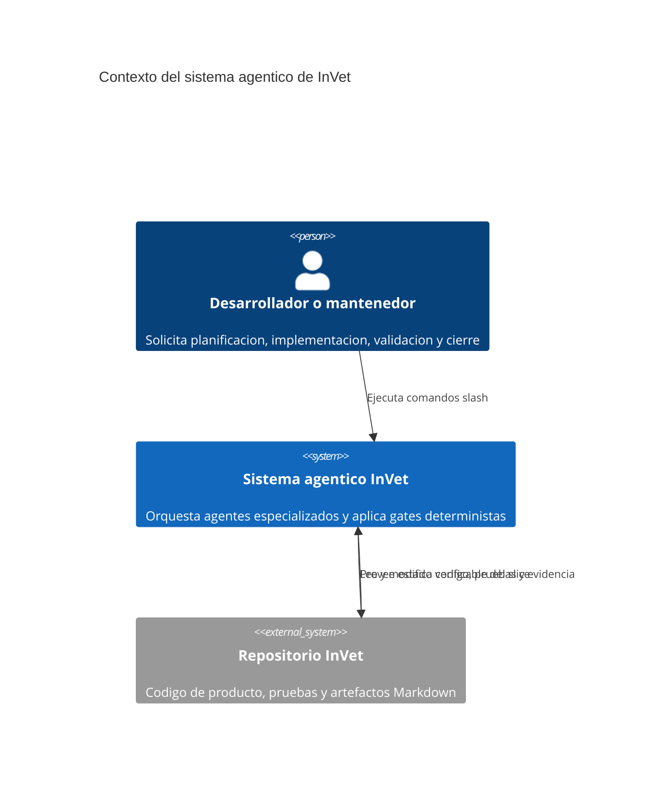
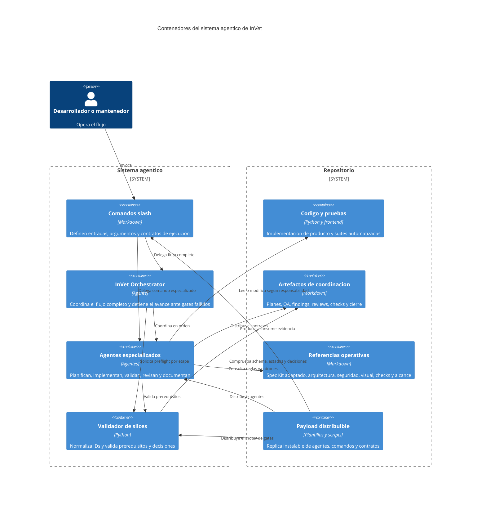
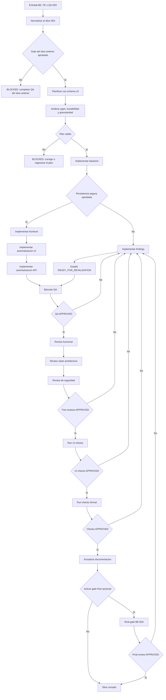
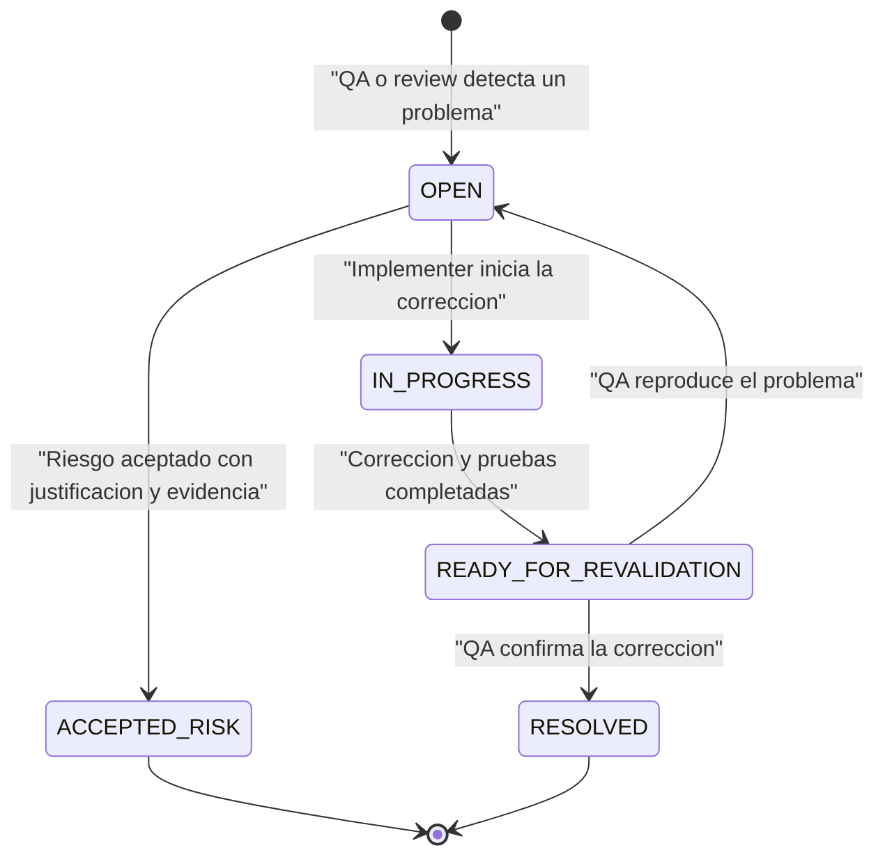

# Arquitectura agentica y gate flow de InVet

## Estado del documento

| Campo | Valor |
|---|---|
| Estado | Vigente |
| Contrato de plan | Schema v3 |
| Entrada orquestada | `/execute-slice BE-00X`, `/execute-slice FE-00X` o `/execute-slice QA-00X` |
| Motor de gates | `backend/scripts/validate_slice_plan.py` |
| Plan canonico | `docs/opencode/plans/BE-00X-plan.md` |
| Evidencia de cierre | QA, UI checks, tres revisiones, checks, documentacion y gate final opcional |

Este documento describe la arquitectura operativa actual de los agentes de InVet. Su objetivo es dejar claro como se coordinan, que archivos Markdown intercambian, quien puede modificar codigo y que condiciones bloquean el avance de un slice.

Las fuentes normativas complementarias son:

- `.opencode/agents/invet-orchestrator.md`
- `.opencode/commands/execute-slice.md`
- `backend/scripts/validate_slice_plan.py`
- `docs/opencode/04_agent_contracts.md`
- `docs/opencode/05_done_gates_by_command.md`
- `docs/opencode/templates/slice_plan_template.md`
- `docs/opencode/references/spec_kit_reference_improvements.md`

En caso de discrepancia, prevalecen el validador determinista y el contrato del comando que se esta ejecutando.

## Inventario recuperado

La restauracion esperada del sistema agentico incluye 16 agentes activos en `.opencode/agents`:

- `invet-orchestrator.md`
- `invet-product-planner.md`
- `invet-backend-implementer.md`
- `invet-frontend-implementer.md`
- `invet-ui-automation-implementer.md`
- `invet-api-automation-implementer.md`
- `invet-qa-validator.md`
- `invet-slice-reviewer.md`
- `invet-clean-architecture-reviewer.md`
- `invet-security-reviewer.md`
- `invet-findings-implementer.md`
- `invet-check-runner.md`
- `invet-docs-updater.md`
- `invet-final-reviewer.md`
- `invet-command-executor.md`
- `invet-command-executor-fallback.md`

Tambien incluye 15 comandos slash en `.opencode/commands`:

- `/execute-slice`
- `/plan-task`
- `/implement-backend-task`
- `/implement-frontend-task`
- `/implement-ui-automation-task`
- `/implement-api-automation-task`
- `/qa-task`
- `/review-slice`
- `/clean-architecture-review`
- `/security-review`
- `/implement-findings`
- `/run-ui-checks`
- `/run-checks`
- `/update-docs`
- `/final-gate`

Los agentes `invet-command-executor` e `invet-command-executor-fallback` no representan gates por si mismos. Son agentes de soporte para ejecutar comandos mecanicos, pruebas, lint, lectura de logs y reintentos reproducibles cuando un agente principal necesita evidencia cruda.
Ambos usan el modelo seleccionado por el usuario y no fijan una decision de producto, arquitectura o seguridad; esa decision siempre vuelve al agente principal que delego la ejecucion.

## Principios del sistema

1. Un slice funcional se identifica por un indice compartido: `US-00X`, `BE-00X`, `FE-00X`, `QA-00X`, `UIA-00X` y `APIA-00X` pertenecen al mismo slice `00X`.
2. Existe un unico plan canonico por slice: `docs/opencode/plans/BE-00X-plan.md`.
3. `/plan-task` acepta identificadores BE, FE o QA, normaliza al plan canonico BE del mismo indice y actualiza `US/UIA/APIA`.
4. Los agentes se coordinan mediante artefactos Markdown versionables; no dependen de memoria conversacional para decidir si un gate fue aprobado.
5. Los comandos especializados pueden ejecutarse directamente, pero su preflight aplica los mismos gates que el flujo orquestado.
6. La existencia de un archivo no equivale a aprobacion. Las decisiones y estados declarados dentro de los artefactos son obligatorios.
7. QA valida y bloquea, pero no corrige codigo de producto ni implementa las pruebas unitarias que corresponden a BE o FE.
8. Un slice solo se considera cerrado cuando QA, las tres revisiones y los checks estan aprobados, y la documentacion final fue actualizada.
9. Los planes nuevos usan schema v3 y deben declarar contexto, trazabilidad, contrato Docker/pruebas, plan de reportes/findings y politica UTF-8.
10. Las tareas deben ser pequenas, de una sola capa, de un solo tipo y con `Responsabilidad unica: Si`.
11. Los implementadores no reinterpretan tareas compuestas; las devuelven al planner para division.
12. Todos los planes, reportes, comentarios, evidencias y outcomes operativos deben conservar UTF-8.
13. Los agentes principales pueden delegar ejecucion mecanica, reruns y lectura de logs a `invet-command-executor` o `invet-command-executor-fallback`, pero conservan la decision final del gate.
14. `skipped` solo es valido cuando un check o hook realmente no aplica; entorno roto, dependencia ausente o comando fallido no se convierten en `skipped`.
15. QA intenta autorecuperar dependencias, `.env.qa` y contexto Docker antes de declarar `BLOCKED`.
16. La normalizacion de IDs es explicita por comando: BE, FE y QA representan el mismo slice vertical, pero un alias no soportado debe rechazarse y redirigirse al comando correcto.
17. Si el slice hereda tareas postergadas, el plan origen, el plan destino y el registro de carryovers deben coincidir antes de cerrar QA, reviews, checks o docs.
18. `review`, `checks` y `docs` son gates de cierre de tareas: bloquean toda tarea aplicable abierta y toda cancelacion sin evidencia verificable. Los stages anteriores conservan tareas abiertas porque funcionan como preflights de trabajo.

## Cambios schema v3 implementados

La arquitectura agentica adopta aprendizajes de `github/spec-kit` sin copiar su estructura completa. InVet conserva su plan canonico por slice, pero agrega controles equivalentes a especificacion, plan, tareas, analisis e implementacion:

| Area | Cambio implementado | Efecto operativo |
|---|---|---|
| Contexto | `Fuentes y artefactos de contexto` | Los agentes saben que documentos leer antes de decidir o editar |
| Trazabilidad | `Matriz de trazabilidad` | Cada criterio, riesgo o contrato se conecta con tarea, validacion y evidencia |
| Granularidad | Nuevos campos de tarea schema v3 | El planner genera tareas pequenas y los implementadores rechazan tareas compuestas |
| Docker y pruebas | `Contrato de ejecucion Docker y pruebas` | QA e implementacion distinguen host local, PostgreSQL en contenedor y runtime completo |
| Reportes | `Plan de reportes y findings` | Cada agente sabe que artefacto produce y quien lo consume |
| UTF-8 | `encoding: UTF-8` y politica UTF-8 | Se evitan redacciones, comentarios y outcomes con encoding roto |
| Validador | `validate_slice_plan.py` exige schema v3 | Los gaps se detectan antes de iniciar implementacion |
| Delegacion mecanica | `invet-command-executor` y `fallback` | Los agentes principales pueden pedir evidencia cruda y reintentos sin mezclar criterio mecanico con criterio funcional |
| QA autorecuperable | `prepare_qa_env.py`, `.env.qa` y fallback a contenedores | QA intenta reparar dependencias y entorno antes de bloquear el slice |
| Skips verificables | `git status` y regla estricta de `skipped` | Docker y checks solo se omiten con causa comprobable; no se maquillan fallos |
| Automatizacion por slice | `US-00X`, `UIA-00X`, `APIA-00X` y `InVet_UI_Automation/` | La planeacion y la implementacion incluyen cobertura funcional visible y contratos HTTP externos |
| Gobernanza de carryovers | `docs/opencode/references/carryovers_governance.md`, `docs/opencode/carryovers/BE-00X-carryovers.md` y `backend/scripts/validate_slice_plan.py` | QA, reviews, checks y docs bloquean estados abiertos o desalineados antes del cierre |

## Nuevas capacidades operativas

La funcionalidad agentica actual ya no solo define un orden de gates. Tambien agrega capacidades de ejecucion, recuperacion y cierre que reducen friccion entre agentes sin perder trazabilidad.

| Capacidad | Donde vive | Impacto en el flujo |
|---|---|---|
| Delegacion mecanica a ejecutores | `invet-orchestrator`, `invet-check-runner`, `invet-qa-validator`, `invet-findings-implementer`, `invet-final-reviewer` | Los agentes de criterio delegan comandos repetitivos, reruns, logs y validaciones crudas sin perder propiedad del gate |
| Findings por slice o por archivo | `/implement-findings` | El agente puede entrar por `BE-00X`, `FE-00X` o una ruta puntual de hallazgos y consolidar correcciones del mismo slice |
| Review vertical con entrada FE | `/review-slice BE-00X|FE-00X` | Frontend puede disparar la revision del mismo slice sin duplicar reportes ni inventar otro indice |
| Redireccion explicita de QA | `/review-slice`, `review` stage | Si alguien intenta revisar con `QA-00X`, el flujo no remapea silenciosamente; exige `/qa-task QA-00X` |
| Planeacion con historias y automatizacion | `/plan-task` | El planner deja `US-00X`, `UIA-00X` y `APIA-00X` listos antes de implementar o validar |
| Workspace dedicado de automatizacion | `InVet_UI_Automation/` | UI y API automation viven fuera del producto principal, pero forman parte del mismo gate del slice |
| Cierre Docker condicionado por cambios | `/run-checks`, `/qa-task` y hooks de implementacion | El restart del stack se ejecuta solo si hay cambios relevantes en `backend`, `frontend`, `docker-compose.yml`, `Dockerfile*` o lockfiles/manifiestos |
| QA con autorecuperacion | `/qa-task` | QA puede instalar dependencias, preparar `.env.qa` y preferir contenedores antes de marcar `BLOCKED` |
| Preflight de plan y QA | `/plan-task`, `/qa-task` | Plan valida el slice previo antes de crear o reparar artefactos; QA valida el plan vigente y recupera entorno antes de bloquearse |
| Preflight auto-recuperable UI/API | `/implement-ui-automation-task`, `/implement-api-automation-task` | Los agentes de automatizacion intentan recuperar dependencias, validan que el plan este vigente, usan Docker cuando el slice depende de PostgreSQL o del runtime del repo y no reutilizan evidencia stale antes de bloquear |
| Validacion UI formal | `/run-ui-checks` | La automatizacion de navegador y regresion UI tiene un gate dedicado antes del cierre tecnico global |
| Gate final con evidencia mecanica delegada | `/final-gate` | El reviewer final puede pedir logs, reruns o pruebas crudas al ejecutor mecanico antes de decidir release |

## Entradas operativas

### Ejecucion completa

```text
/execute-slice FE-001
```

El identificador puede ser BE, FE o QA. El orquestador normaliza el indice y conduce el flujo completo sin cambiar de slice.

### Ejecucion especializada

```text
/plan-task FE-001
/implement-backend-task BE-001
/implement-frontend-task FE-001
/implement-ui-automation-task FE-001
/implement-api-automation-task BE-001
/qa-task QA-001
/review-slice FE-001
/clean-architecture-review FE-001
/security-review FE-001
/run-ui-checks FE-001
/implement-findings FE-001
/run-checks FE-001
/update-docs FE-001
/final-gate FE-001
```

Cada comando especializado ejecuta un preflight para comprobar que sus prerequisitos ya existen y estan aprobados. Esto evita que una invocacion directa omita los gates del orquestador.

`/run-checks` sin identificador conserva un uso diagnostico general, pero no genera evidencia formal ni cierra un slice. Para el gate de cierre debe utilizarse `/run-checks BE-00X`, `/run-checks FE-00X` o `/run-checks QA-00X`.

`/final-gate` es opcional y solo se usa cuando se desea una segunda opinion de alta capacidad antes de liberar el slice.

Normalizaciones y rechazos relevantes:

- `/plan-task`, `/run-checks`, `/update-docs` y `/final-gate` aceptan `BE-00X`, `FE-00X` o `QA-00X` y normalizan al mismo slice vertical.
- `/review-slice` acepta `BE-00X` o `FE-00X`; si recibe `QA-00X`, debe rechazar esa entrada y redirigir a `/qa-task QA-00X`.
- `/implement-findings` acepta `BE-00X`, `FE-00X` o una ruta de hallazgos; si entra por FE, deriva al mismo `BE-00X` vertical.

### Como se usa en la practica

`/plan-task` se ejecuta una sola vez por slice funcional, no una vez por cada area. Da igual si se invoca como `/plan-task BE-001`, `/plan-task FE-001` o `/plan-task QA-001`: el comando normaliza el indice `001` y genera o actualiza el plan canonico `docs/opencode/plans/BE-001-plan.md`.

Ese plan canonico debe contener las tareas de todas las areas del mismo slice:

- `BE-001-TNN` para backend y API de producto.
- `FE-001-TNN` para frontend y UI de producto.
- `QA-001-TNN` para validacion QA.
- `UIA-001-TNN` para automatizacion UI/E2E.
- `APIA-001-TNN` para automatizacion API/HTTP.

Despues del plan, cada area se implementa con su comando especializado y luego se ejecutan todos los gates de cierre. Si se usa `/execute-slice FE-001`, el orquestador conduce esta secuencia completa y se detiene cuando un gate queda bloqueado. Si se opera paso a paso, la ruta completa hasta el ultimo comando es:

```text
/plan-task FE-001
/implement-backend-task BE-001
python backend/scripts/validate_slice_plan.py BE-001 --stage secure-persistence
/implement-frontend-task FE-001
/implement-ui-automation-task FE-001
/implement-api-automation-task BE-001
/qa-task QA-001
/review-slice FE-001
/clean-architecture-review FE-001
/security-review FE-001
/run-ui-checks FE-001
/run-checks FE-001
/update-docs FE-001
/final-gate FE-001
```

`/final-gate` es el ultimo comando de la ruta cuando se activa la segunda opinion de release. Si no se usa gate final, el ultimo comando normal es `/update-docs FE-001` despues de `/run-checks FE-001` aprobado.

Si QA, UI checks, reviews o checks encuentran hallazgos, el slice no avanza por otro camino paralelo. Primero se corrigen los hallazgos y despues se vuelve a ejecutar el gate que los detecto y los gates que dependian de el:

```text
/implement-findings FE-001
/qa-task QA-001
/review-slice FE-001
/clean-architecture-review FE-001
/security-review FE-001
/run-ui-checks FE-001
/run-checks FE-001
```

La regla practica es:

- Si falla QA, ejecutar `/implement-findings BE|FE-00X` y despues repetir `/qa-task QA-00X`.
- Si falla una review, ejecutar `/implement-findings BE|FE-00X` y despues repetir QA y las reviews afectadas.
- Si falla `/run-ui-checks`, ejecutar `/implement-findings BE|FE-00X`, repetir QA cuando el producto cambio, y volver a ejecutar `/run-ui-checks FE-00X`.
- Si falla `/run-checks`, ejecutar `/implement-findings BE|FE-00X` o corregir el bloqueo operativo reportado, y despues repetir los gates impactados antes de cerrar.
- Si el hallazgo queda como `READY_FOR_REVALIDATION`, todavia bloquea. Solo QA o el reviewer responsable puede cerrarlo como `RESOLVED` o aceptarlo como `ACCEPTED_RISK` con justificacion.

Cuando QA ya esta aprobado y no hay findings bloqueantes, se continua con los gates de cierre:

```text
/review-slice FE-001
/clean-architecture-review FE-001
/security-review FE-001
/run-ui-checks FE-001
/run-checks FE-001
/update-docs FE-001
/final-gate FE-001
```

Los gates despues de QA no son decorativos: una aprobacion de QA por si sola no cierra el slice. El cierre requiere reviews, UI checks cuando aplican, checks formales, documentacion y, si fue activado, final gate.

### Que debe sugerir cada ejecucion al terminar

Cada comando del flujo debe cerrar con una recomendacion explicita del siguiente paso. La salida esperada no debe terminar solo en `APPROVED`, `REJECTED` o `BLOCKED`: tambien debe indicar que comando sigue en el flujo normal y cual es el comando recomendado si hay hallazgos o si el gate quedo bloqueado.

| Comando que termina | Si el gate queda aprobado y sin findings | Si hay findings o el gate queda bloqueado |
|---|---|---|
| `/plan-task BE|FE|QA-00X` | Sugerir `/implement-backend-task BE-00X` | Sugerir el comando que desbloquea el plan, normalmente `/plan-task BE-00X` o `/qa-task QA-00Y` si el bloqueo viene del slice anterior |
| `/implement-backend-task BE-00X` | Sugerir `python backend/scripts/validate_slice_plan.py BE-00X --stage secure-persistence` y luego `/implement-frontend-task FE-00X` | Sugerir `/implement-backend-task BE-00X` para completar tareas pendientes o `/implement-findings BE-00X` si el hallazgo ya quedo formalizado |
| `secure-persistence` | Sugerir `/implement-frontend-task FE-00X` | Sugerir volver a backend o `/implement-findings BE-00X` segun el artefacto que reporto el problema |
| `/implement-frontend-task FE-00X` | Sugerir `/implement-ui-automation-task FE-00X` | Sugerir `/implement-frontend-task FE-00X` para completar tareas pendientes o `/implement-findings FE-00X` si ya existe hallazgo formal |
| `/implement-ui-automation-task FE-00X` | Sugerir `/implement-api-automation-task BE-00X` | Sugerir `/implement-ui-automation-task FE-00X` o `/plan-task BE-00X` si falta `UIA-00X` |
| `/implement-api-automation-task BE-00X` | Sugerir `/qa-task QA-00X` | Sugerir `/implement-api-automation-task BE-00X` o `/plan-task BE-00X` si falta `APIA-00X` |
| `/qa-task QA-00X` | Sugerir `/review-slice BE-00X` solo si `Decision: APPROVED` y no hay findings bloqueantes | Sugerir `/implement-findings BE-00X` si hay findings `OPEN`/`IN_PROGRESS`; si todo quedo `READY_FOR_REVALIDATION`, seguir el flujo de correcciones y dejar que el resolver vuelva a impulsar la revalidacion QA; si el bloqueo es de contrato o artefacto faltante, sugerir `/plan-task BE-00X` |
| `/review-slice FE|BE-00X` | Sugerir `/clean-architecture-review BE-00X` cuando el review se ejecuto y quedo `APPROVED` | Sugerir `/implement-findings BE-00X` si el review se ejecuto y quedo `REJECTED`; sugerir `/qa-task QA-00X` solo si el preflight impidio revisar porque QA no esta aprobado o necesita revalidacion |
| `/clean-architecture-review FE|BE-00X` | Sugerir `/security-review FE-00X` | Sugerir `/implement-findings FE-00X` |
| `/security-review FE|BE-00X` | Sugerir `/run-ui-checks FE-00X` | Sugerir `/implement-findings FE-00X` |
| `/run-ui-checks FE-00X` | Sugerir `/run-checks FE-00X` | Sugerir `/implement-findings FE-00X` |
| `/run-checks BE|FE|QA-00X` | Sugerir `/update-docs FE-00X` | Sugerir `/implement-findings FE-00X` o el comando operativo que desbloquea el check fallido |
| `/update-docs BE|FE|QA-00X` | Sugerir `/final-gate FE-00X` si se desea segunda opinion; si no, declarar que no quedan comandos obligatorios del slice | Sugerir volver al gate rechazado anterior; `/update-docs` no debe usarse para maquillar un gate pendiente |
| `/final-gate BE|FE|QA-00X` | Declarar slice cerrado y sugerir iniciar el siguiente slice con `/plan-task BE-00Y` cuando exista un nuevo indice | Sugerir `/implement-findings FE-00X` o el gate exacto cuya evidencia quedo incompleta |
| `/implement-findings BE|FE-00X` | Sugerir `/qa-task QA-00X` como primer gate de revalidacion y luego repetir reviews, UI checks y checks afectados | Si el finding no pudo corregirse, mantener `READY_FOR_REVALIDATION` o `OPEN` y sugerir el comando de la capa responsable o `/plan-task BE-00X` si el hallazgo nace de un contrato roto |
| `/execute-slice BE|FE|QA-00X` | Sugerir el siguiente gate pendiente si el flujo se detuvo antes del cierre; si completo todo, sugerir `/final-gate FE-00X` cuando sea opcional o declarar slice cerrado | Sugerir el comando exacto para reanudar desde el primer gate fallido, normalmente `/implement-findings FE-00X`, `/qa-task QA-00X` o `/plan-task BE-00X` |

Para mantener la continuidad del flujo, la recomendacion debe incluir el comando exacto y el motivo. Formato esperado al cierre:

```text
Siguiente paso recomendado: /review-slice BE-00X
Motivo: QA quedo APPROVED y el siguiente gate obligatorio del slice es la revision funcional.
```

Si existen hallazgos, el cierre debe agregar una recomendacion separada para resolverlos:

```text
Comando recomendado para resolver hallazgos: /implement-findings BE-001
Motivo: QA genero findings OPEN y el flujo exige corregirlos antes de continuar con reviews o checks.
```

La pregunta clave es separar producto de automatizacion:

| Trabajo | Donde se implementa | Comando | Artefacto de plan/evidencia |
|---|---|---|---|
| API de producto | `backend/` | `/implement-backend-task BE-00X` | Tareas `BE-00X-TNN` en `BE-00X-plan.md` |
| UI de producto | `frontend/` o la app frontend vigente del repo | `/implement-frontend-task FE-00X` | Tareas `FE-00X-TNN` en `BE-00X-plan.md` |
| UI automation | `InVet_UI_Automation/` | `/implement-ui-automation-task FE-00X` | `docs/opencode/tasks/ui-automation/UIA-00X.md` y tareas `UIA-00X-TNN` |
| API automation | `InVet_UI_Automation/` | `/implement-api-automation-task BE-00X` | `docs/opencode/tasks/api-automation/APIA-00X.md` y tareas `APIA-00X-TNN` |
| QA funcional | Suites QA y reportes bajo `docs/opencode/qa/` | `/qa-task QA-00X` | `QA-00X-results.md` y findings |

En otras palabras: el planner genera el plan para BE, FE, QA, UIA y APIA en una sola pasada. Los implementadores no vuelven a planear el slice; solo consumen las tareas que les corresponden. Si falta una tarea de UI automation o API automation, el flujo correcto es volver a `/plan-task` para completar el plan, no inventar la cobertura dentro del implementador.

`FA-00X` no es un alias valido en este contrato. Si se queria decir frontend, el prefijo correcto es `FE-00X`.

## C4 nivel 1: contexto



El usuario puede entrar por `/execute-slice` o por un comando especializado. En ambos casos, el estado persistido en el repositorio determina si el flujo puede continuar.

## C4 nivel 2: contenedores



## C4 nivel 3: flujo y gates



El orden canonico administrado por el orquestador es:

1. `/plan-task BE|FE|QA-00X`
2. Analisis de gaps, trazabilidad, granularidad y UTF-8 dentro del plan.
3. `/implement-backend-task BE-00X`
4. Gate de Persistencia segura: `python backend/scripts/validate_slice_plan.py BE-00X --stage secure-persistence`
5. `/implement-frontend-task FE-00X`
6. `/implement-ui-automation-task FE-00X`
7. `/implement-api-automation-task BE-00X`
8. `/qa-task QA-00X`
9. `/review-slice BE-00X`
10. `/clean-architecture-review BE-00X`
11. `/security-review BE-00X`
12. `/run-ui-checks FE-00X`
13. `/implement-findings BE-00X`, solo cuando existen hallazgos bloqueantes
14. Repetir QA, UI checks y las revisiones afectadas despues de corregir
15. `/run-checks BE-00X`
16. `/update-docs BE-00X`
17. `/final-gate BE-00X`, solo si se activa la segunda opinion de release

Los prefijos mostrados en este orden son convencionales. El validador normaliza BE, FE y QA al mismo indice de slice.
Durante este flujo, el orquestador y los agentes especializados pueden delegar lotes mecanicos de comandos, logs o reintentos a `invet-command-executor` y, si hace falta mas robustez, a `invet-command-executor-fallback`.

## Responsabilidades por agente

| Agente | Comando principal | Responsabilidad | Puede modificar codigo | Evidencia o gate |
|---|---|---|---|---|
| InVet Orchestrator | `/execute-slice` | Normalizar el ID, coordinar agentes y detenerse ante gates fallidos | Solo por delegacion | Flujo completo del slice |
| Product Planner | `/plan-task` | Crear el plan canonico schema v3 con tareas BE, FE y QA trazables, mas `US/UIA/APIA` | No | `BE-00X-plan.md` valido |
| Backend Implementer | `/implement-backend-task` | Implementar backend y sus pruebas unitarias | Si, backend y pruebas relacionadas | Tareas BE y validaciones satisfechas |
| Frontend Implementer | `/implement-frontend-task` | Implementar UI, integracion y pruebas unitarias de frontend | Si, frontend y pruebas relacionadas | Tareas FE y validaciones satisfechas |
| UI Automation Implementer | `/implement-ui-automation-task` | Implementar E2E, formularios, navegacion, redirects y estados UI con Playwright | Si, solo `InVet_UI_Automation/` y documentacion asociada | `UIA-00X.md` con evidencia |
| API Automation Implementer | `/implement-api-automation-task` | Implementar contratos HTTP externos con Playwright `APIRequestContext` | Si, solo `InVet_UI_Automation/` y documentacion asociada | `APIA-00X.md` con evidencia |
| QA Engineer | `/qa-task` | Ejecutar QA, ampliar pruebas de nivel QA, intentar autorecuperacion de entorno y emitir decision | Solo pruebas y soporte QA, no producto | `QA-00X-results.md` con `APPROVED`, `REJECTED` o `BLOCKED`, y findings |
| Slice Reviewer | `/review-slice` | Revisar comportamiento, regresiones, trazabilidad y cobertura del slice vertical desde entrada BE o FE | No, excepto su reporte Markdown | `BE-00X-review.md` con decision |
| Clean Architecture Reviewer | `/clean-architecture-review` | Revisar limites, dependencias y mantenibilidad | No, excepto su reporte Markdown | `BE-00X-clean-architecture-review.md` con decision |
| Security Reviewer | `/security-review` | Revisar autenticacion, autorizacion, datos y riesgos | No, excepto su reporte Markdown | `BE-00X-security-review.md` con decision |
| Findings Implementer | `/implement-findings` | Corregir hallazgos en codigo y pruebas del propietario correcto desde un slice o un archivo puntual de findings | Si | Correcciones en `READY_FOR_REVALIDATION` |
| Check Runner | `/run-checks` y `/run-ui-checks` | Ejecutar la suite integral, distinguir `pass/fail/skipped/blocked` y decidir si aplica cierre Docker | No deberia corregir producto salvo modo correccion explicito | `BE-00X-checks.md` con decision |
| Documentation Agent | `/update-docs` | Consolidar documentacion y cierre despues de todos los gates, normalizando el mismo slice vertical | Solo documentacion | Documentacion final actualizada |
| Final Reviewer | `/final-gate` | Emitir una segunda opinion de release y pedir evidencia mecanica adicional cuando haga falta | No, excepto su reporte Markdown | `BE-00X-final-review.md` con decision |
| Command Executor | Delegado por agentes principales | Ejecutar comandos mecanicos, pruebas, lint, inspeccion de diff y lectura de logs usando el modelo elegido por el usuario | Solo cambios mecanicos dentro del alcance delegado | Comandos ejecutados, salida sintetizada y bloqueos |
| Command Executor Fallback | Delegado por agentes principales | Respaldar al ejecutor primario cuando se requiere mas contexto o robustez, sin redefinir el modelo de trabajo | Solo cambios mecanicos dentro del alcance delegado | Evidencia mecanica alternativa o reintentos |

## Contrato del plan schema v3

El plan canonico debe incluir este frontmatter:

```yaml
---
schema_version: 3
slice: "00X"
canonical_plan: BE-00X
status: PLANNED
encoding: UTF-8
---
```

Debe cubrir explicitamente contexto, trazabilidad, frontend, automatizacion, Docker, reportes y UTF-8 mediante estas secciones:

- Fuentes y artefactos de contexto
- Matriz de trazabilidad
- Rutas y acceso
- Flujos y estados UX
- Contratos API por accion
- Formularios y validacion
- Arquitectura de componentes
- Responsive y accesibilidad
- Estrategia de pruebas frontend
- Estrategia de automatizacion UI
- Estrategia de automatizacion API
- Contrato de ejecucion Docker y pruebas
- Plan de reportes y findings
- Politica UTF-8

El plan canonico debe coordinar entregables `BE`, `FE`, `QA`, `UIA` y `APIA`, y crear o actualizar los artefactos `US-00X.md`, `UIA-00X.md` y `APIA-00X.md`.

Cada tarea usa el formato `- [ ] BE|FE|QA|UIA|APIA-00X-TNN - Titulo` e incluye:

| Campo | Proposito |
|---|---|
| `Capa` | Identifica backend, frontend, QA, UI automation o API automation |
| `Tipo` | Clasifica el trabajo: contrato, persistencia, API, UI, prueba, Docker, reporte, etc. |
| `Historia o criterio` | Vincula la tarea con la matriz de trazabilidad |
| `Objetivo` | Declara el resultado esperado |
| `Responsabilidad unica` | Debe ser `Si`; impide tareas compuestas |
| `Depende de` | Expresa dependencias explicitas |
| `Contexto necesario` | Lista fuentes que el agente debe leer antes de editar |
| `Contratos usados` | Vincula endpoints, criterios, referencias o reportes que gobiernan la tarea |
| `Entregables` | Define archivos o capacidades a producir |
| `Criterios de aceptacion` | Establece condiciones observables |
| `Validacion` | Indica como comprobar el resultado |
| `Resultado esperado` | Define el outcome verificable para el siguiente agente |
| `Evidencia` | Define la prueba persistente del cumplimiento |
| `Paralelismo[P]` | Declara si la tarea puede ejecutarse en paralelo |

Un plan legacy o schema v1/v2 es rechazado intencionalmente. Debe regenerarse con `/plan-task BE-00X`, `/plan-task FE-00X` o `/plan-task QA-00X`; los tres comandos apuntan al mismo plan canonico.

## Granularidad y responsabilidad unica

El planner debe generar tareas que un agente pueda ejecutar sin contexto conversacional adicional. La tarea ideal modifica una sola capa, tiene un solo tipo de trabajo y deja un resultado observable para el siguiente agente.

Reglas obligatorias:

- `Responsabilidad unica` debe ser `Si`.
- `Objetivo` debe ser corto y no compuesto.
- `Tipo` clasifica el trabajo como contrato, persistencia, caso de uso, API, seguridad, cliente API, ruta, componente, estado UX, UI automation, API automation, prueba, QA, documentacion, Docker o reporte.
- `Contexto necesario` lista archivos, criterios o decisiones que el implementador debe leer antes de editar.
- `Contratos usados` indica endpoints, criterios, referencias o reportes que gobiernan la tarea.
- `Resultado esperado` declara el outcome que QA, reviews o el siguiente implementador pueden verificar.

Una tarea debe dividirse si mezcla:

- Persistencia y endpoint.
- Caso de uso y router.
- UI y cliente API.
- UI y automatizacion UI del mismo criterio.
- Contrato backend y automatizacion API del mismo criterio.
- Formulario y estados UX complejos.
- Implementacion y pruebas.
- Seguridad y funcionalidad general.
- UI automation y API automation dentro de la misma tarea.
- Docker y pruebas de producto.
- Documentacion y cambios de codigo.

Los agentes de implementacion deben detenerse si una tarea no cumple este contrato. No deben resolver la ambiguedad implementando un bloque mas grande.

## Contrato Docker y pruebas

Schema v3 hace explicito cuando una validacion debe correr en host local, en contenedor o con el stack completo.

| Necesidad | Contrato operativo |
|---|---|
| Persistencia PostgreSQL | Levantar `db` y preferir pruebas dentro del servicio `backend` |
| Pruebas backend con DB real | Usar `docker compose run --rm backend pytest ...` o `docker compose exec backend ...` si el contenedor ya esta vivo |
| Runtime completo despues de cambios relevantes | Ejecutar `docker compose up -d --build --force-recreate db backend frontend` |
| Frontend | Usar scripts locales `lint`, `typecheck`, `test` y `build`; el contenedor `frontend` es runtime salvo que el plan prepare testing ahi |
| Skip Docker | Solo permitido con causa exacta y verificable |

QA no debe considerar equivalente una corrida local si el plan o el criterio exige PostgreSQL o runtime en contenedor.
Los hooks de cierre de implementacion, QA y checks deben revisar antes `git status` y solo recrear contenedores cuando existan cambios relevantes para runtime o dependencias.

### Rutas canónicas del runtime

| Caso | Ruta canónica |
|---|---|
| Frontend base | `http://localhost:3000` |
| Backend base | `http://localhost:8000` |
| API base | `/api/v1` |
| UI pública de clínicas | `http://localhost:3000/clinicas` |
| UI de citas del propietario | `http://localhost:3000/portal/owner/appointments` |
| UI de alta de cita | `http://localhost:3000/portal/owner/appointments/new` |
| UI de agenda clínica | `http://localhost:3000/clinic/appointments` |
| API pública de clínicas | `http://localhost:8000/api/v1/clinicas` |
| API de citas | `http://localhost:8000/api/v1/appointments` |
| Router BE-008 | `backend/app/api/v1/routers/appointment_router.py` |
| Schemas BE-008 | `backend/app/api/v1/schemas/appointment_schemas.py` |

Las suites UI y de regresion deben correr sobre `http://localhost:3000`; las suites API deben apuntar al backend en `http://localhost:8000` con rutas bajo `/api/v1`. Si un reporte menciona la UI de clínicas o la agenda de citas, el archivo de referencia debe dejar claro qué ruta de frontend se usó y qué endpoint de backend la alimenta.

## Autorecuperacion QA

Antes de declarar `BLOCKED`, QA debe intentar:

- Preparar dependencias con `backend/scripts/prepare_qa_env.py --install-deps` o su equivalente desde `backend/`.
- Preferir `.env.qa` con `DATABASE_URL` y `SECRET_KEY` temporales de QA cuando falte configuracion local.
- Mover la validacion a `docker compose up -d db` mas `docker compose run --rm backend ...` cuando el host no represente el entorno exigido.
- Tratar resultados QA previos como `stale` si el plan, el diff o el filesystem cambiaron desde la corrida anterior.

Si aun asi no puede ejecutar evidencia confiable, entonces si corresponde `Decision: BLOCKED`.

## Politica UTF-8

Todos los artefactos operativos nuevos deben conservar UTF-8:

- Planes.
- Reportes QA.
- Findings.
- Reviews.
- Checks.
- Correcciones.
- Comentarios y outcomes escritos por agentes.

El validador rechaza planes con mojibake probable. Los scripts Python propios deben leer y escribir Markdown con `encoding="utf-8"` y emitir JSON con `ensure_ascii=False`.

## Motor determinista de gates

`backend/scripts/validate_slice_plan.py` evita que los agentes interpreten de forma distinta el estado del slice. Acepta un ID BE, FE o QA y una etapa.

| Etapa | Validacion principal |
|---|---|
| `previous` | El QA del slice inmediatamente anterior no mantiene un bloqueo activo |
| `plan` | Existe el plan canonico, usa schema v3 y contiene estructura, trazabilidad, UTF-8 y tareas validas |
| `backend` | El gate anterior y el plan permiten iniciar implementacion backend |
| `secure-persistence` | Las tareas backend de ORM, repositorios, migraciones, permisos, ownership, IDOR/BOLA o auditoria estan completadas con evidencia |
| `frontend` | El plan y prerequisitos permiten iniciar implementacion frontend |
| `qa` | El plan e implementaciones requeridas permiten evaluar el slice |
| `findings` | Existen hallazgos accionables que pueden ser corregidos |
| `review` | QA esta aprobado y el slice puede entrar a revision |
| `checks` | QA y las tres revisiones declaran `Decision: APPROVED` |
| `docs` | QA, revisiones y reporte formal de checks estan aprobados |

Los comandos deben tratar una salida no exitosa del validador como `BLOCKED`. No esta permitido continuar basandose solo en que los archivos existen.

Reglas adicionales del motor operativo:

- Un gate fallido no puede maquillarse como `skipped`.
- `skipped` solo aplica a checks o hooks no relevantes para el slice o al tooling no configurado por contrato.
- `OPEN`, `IN_PROGRESS` y `READY_FOR_REVALIDATION` siguen bloqueando el siguiente slice hasta nueva decision QA.

## Propiedad de las pruebas

La separacion de responsabilidades evita que QA oculte defectos de implementacion al corregir el producto que debe evaluar.

| Tipo de prueba | Propietario primario | Puede crearla QA | Ausencia bloquea |
|---|---|---|---|
| Unitarias de backend | Backend Implementer | No | Si |
| Unitarias de frontend | Frontend Implementer | No | Si |
| Aceptacion | QA Engineer | Si | Si, cuando corresponde al criterio |
| Integracion | QA Engineer o implementador segun el plan | Si | Si, cuando corresponde al riesgo |
| Contrato API | QA Engineer | Si | Si, cuando protege una integracion critica |
| Seguridad | QA Engineer y Security Reviewer | QA puede crear pruebas; reviewer emite hallazgos | Si para riesgos no mitigados |
| Regresion | QA Engineer | Si | Si para regresiones relevantes |
| Fixtures, mocks y factories de QA | QA Engineer | Si | Segun necesidad de la suite |

Si QA detecta codigo de producto sin pruebas unitarias suficientes, debe:

1. Marcar el criterio correspondiente como `FAIL`.
2. Crear un finding `OPEN` con evidencia concreta.
3. Emitir `Decision: REJECTED`.
4. Bloquear el avance hasta que Backend Implementer, Frontend Implementer o Findings Implementer agregue las pruebas.
5. Volver a ejecutar `/qa-task QA-00X` para resolver el gate.

QA no debe modificar codigo de producto para hacer pasar su propia evaluacion.

## Ciclo de vida de findings



Reglas del ciclo:

- `/implement-findings` nunca marca un finding como `RESOLVED`; su estado final es `READY_FOR_REVALIDATION`.
- Solo QA puede declarar `RESOLVED` despues de ejecutar evidencia reproducible.
- `OPEN`, `IN_PROGRESS` y `READY_FOR_REVALIDATION` son estados bloqueantes.
- `ACCEPTED_RISK` es no bloqueante unicamente cuando incluye responsable, justificacion y evidencia explicita de aceptacion.
- Despues de una correccion se repiten QA y las revisiones afectadas antes de ejecutar checks.

## Artefactos de coordinacion

| Artefacto | Productor | Consumidores | Funcion |
|---|---|---|---|
| `docs/opencode/plans/BE-00X-plan.md` | Planner | Todos | Plan canonico y trazabilidad de tareas |
| `docs/opencode/tasks/user-stories/US-00X.md` | Planner | Implementadores, QA, checks | Historias `US-00X-NN`, criterios `CA-NN` y matriz de cobertura del slice |
| `docs/opencode/tasks/ui-automation/UIA-00X.md` | Planner y UI Automation Implementer | QA, checks, docs | Cobertura UI/E2E, evidencia, gaps y bloqueos del slice |
| `docs/opencode/tasks/api-automation/APIA-00X.md` | Planner y API Automation Implementer | QA, checks, docs | Cobertura HTTP externa, evidencia, gaps y bloqueos del slice |
| `docs/opencode/references/spec_kit_reference_improvements.md` | Equipo tecnico | Planner, implementadores, QA | Referencia de gaps, decisiones y adaptacion de Spec Kit |
| `docs/opencode/templates/slice_plan_template.md` | Equipo tecnico | Planner, validador, payload | Plantilla schema v3 para planes atomicos |
| `docs/opencode/templates/*_template.md` | Equipo tecnico | QA, reviews, checks, docs | Plantillas UTF-8 para reportes y outcomes |
| `docs/opencode/qa/QA-00X-results.md` | QA Engineer | Orchestrator, reviewers, checks | Resultados por criterio y decision QA |
| `docs/opencode/qa/QA-00X-findings.md` | QA Engineer y reviewers | Findings Implementer, QA | Hallazgos y estados de revalidacion |
| `docs/opencode/reviews/BE-00X-review.md` | Slice Reviewer | Orchestrator, checks | Decision funcional y de regresion |
| `docs/opencode/reviews/BE-00X-clean-architecture-review.md` | Clean Architecture Reviewer | Orchestrator, checks | Decision arquitectonica |
| `docs/opencode/reviews/BE-00X-security-review.md` | Security Reviewer | Orchestrator, checks | Decision de seguridad |
| `docs/opencode/reviews/BE-00X-final-review.md` | Final Reviewer | Orchestrator, release | Decision de release final |
| `docs/opencode/reviews/BE-00X-corrections.md` | Findings Implementer | QA y reviewers | Evidencia de cambios preparados para revalidacion |
| `docs/opencode/checks/BE-00X-checks.md` | Check Runner | Documentation Agent | Resultado integral reproducible y decision de checks |
| Documentacion y changelog del proyecto | Documentation Agent | Equipo | Cierre funcional y operativo |

Cada reviewer genera siempre su reporte, incluso cuando no encuentra problemas. La ausencia del reporte o de `Decision: APPROVED` impide pasar al gate de checks.
Los agentes de decision pueden apoyarse en los ejecutores mecanicos para producir evidencia cruda, pero el reporte final siempre pertenece al agente responsable del gate.

## Matriz de gates

| Transicion | Requisito de entrada | Resultado que permite avanzar | Resultado bloqueante |
|---|---|---|---|
| Inicio -> Plan | Gate del slice anterior valido | Plan schema v3 | Slice anterior bloqueado |
| Plan -> Backend | Plan valido | Implementacion BE y unit tests | Plan incompleto, legacy, sin trazabilidad, con tareas compuestas o con UTF-8 roto |
| Backend -> Persistencia segura | Backend implementado | Tareas de persistencia/seguridad completadas con evidencia | Repositorios, migraciones, ownership, permisos o IDOR/BOLA pendientes |
| Plan/Backend -> Frontend | Plan frontend explicito y contratos disponibles | Implementacion FE y unit tests | Gap de UX, API, dependencias o contrato frontend incompleto |
| Frontend -> Automatizacion | `US-00X`, `UIA-00X` y `APIA-00X` existen y el slice tiene comportamiento verificable | Automatizacion UI y API implementada cuando aplica | Cobertura faltante, artefactos ausentes o evidencia incompleta |
| Implementacion -> QA | Entregables y validaciones del plan disponibles | `Decision: APPROVED` | Criterios FAIL, infraestructura no reproducible, unit tests ausentes, automatizacion faltante o reportes stale |
| QA -> Reviews | QA aprobado | Tres reportes `APPROVED` | Cualquier reporte ausente o `REJECTED` |
| Findings -> Revalidacion | Correcciones en `READY_FOR_REVALIDATION` | QA y reviews afectados aprobados nuevamente | Findings todavia reproducibles |
| Reviews -> UI checks | QA y tres reviews aprobados | `run-ui-checks` aprobado cuando aplica | Fallos E2E, regresion visual/funcional o cobertura UI incompleta |
| UI checks -> Checks | `run-ui-checks` aprobado cuando aplica | Checks `APPROVED` | Fallos de suite, lint, build o infraestructura |
| Checks -> Docs | Reporte formal de checks aprobado | Documentacion actualizada | Checks ausentes o rechazados |
| Docs -> Final review | Documentacion cerrada y gate final activado | `docs/opencode/reviews/BE-00X-final-review.md` aprobado | Gate final rechazado o bloqueado |
| Docs -> Cierre | Todos los artefactos trazables | Slice cerrado | Evidencia incompleta |

En checks y hooks DevOps, un `skip` solo habilita avance cuando el propio reporte demuestra que el check no aplicaba. Si el comando era obligatorio y no pudo ejecutarse, el resultado correcto es `FAIL` o `BLOCKED`.

## Gate del slice anterior

Antes de iniciar un nuevo indice, el validador comprueba el QA del slice inmediatamente anterior. Esto convierte QA en un gate de entrega y evita acumular trabajo nuevo sobre una base conocida como defectuosa.

El bloqueo se basa en el estado y la decision del artefacto, no solo en su existencia. Un finding no bloquea si esta `RESOLVED` o si fue formalmente marcado `ACCEPTED_RISK`; los demas estados impiden continuar.

## Ejecucion recomendada

Para un flujo completo:

```text
/execute-slice FE-001
```

Para operar paso a paso:

```text
/plan-task FE-001
/implement-backend-task BE-001
python backend/scripts/validate_slice_plan.py BE-001 --stage secure-persistence
/implement-frontend-task FE-001
/implement-ui-automation-task FE-001
/implement-api-automation-task BE-001
/qa-task QA-001
/review-slice FE-001
/clean-architecture-review FE-001
/security-review FE-001
/run-ui-checks FE-001
/run-checks FE-001
/update-docs FE-001
/final-gate FE-001
```

Si hay findings:

```text
/implement-findings FE-001
/qa-task QA-001
/review-slice FE-001
/clean-architecture-review FE-001
/security-review FE-001
/run-ui-checks FE-001
```

Cuando todos los gates estan aprobados:

```text
/run-checks FE-001
/update-docs FE-001
/final-gate FE-001
```

El gate final es opcional y se usa cuando hace falta una segunda opinion de alta capacidad antes de liberar el slice.

## Flujo completo BE/FE/QA con UI y API automation

La ruta canónica para completar un slice vertical `BE-00X / FE-00X / QA-00X` es esta. El flujo separa con claridad la implementacion de producto, la automatizacion y la validacion final, para evitar bucles como "QA llama a review y review vuelve a QA" sin correccion real.

| Fase | Comando | Prompt recomendado | Resultado esperado |
|---|---|---|---|
| 1. Plan | `/plan-task BE-00X` | "Lee el contexto del slice 00X, genera o actualiza `docs/opencode/plans/BE-00X-plan.md` con schema v3, crea o actualiza `US-00X`, `UIA-00X` y `APIA-00X`, valida con `backend/scripts/validate_slice_plan.py --stage plan` y al cerrar reporta `Estado de ejecucion` y `Siguiente paso recomendado`." | Plan canonico v3 listo, trazabilidad completa y tareas atomicas definidas |
| 2. Backend | `/implement-backend-task BE-00X` | "Implementa solo las tareas `Capa: backend` pendientes del plan, agrega pruebas unitarias para todo cambio productivo, valida `secure-persistence` cuando aplique y no toques frontend ni automatizacion." | Backend funcional y con evidencia de pruebas |
| 3. Frontend | `/implement-frontend-task FE-00X` | "Implementa solo las tareas `Capa: frontend` pendientes, conserva el sistema visual del proyecto, agrega pruebas de componente o unidad y reporta los archivos tocados con evidencia." | Frontend funcional y verificable |
| 4. UI automation | `/implement-ui-automation-task FE-00X` | "Implementa las especificaciones Playwright en `InVet_UI_Automation/tests/e2e` para los criterios `US-00X-NN` y `CA-NN`, cubre navegación, formularios y estados UX, y documenta evidencia y casos no automatizados." | Cobertura UI/E2E lista para `run-ui-checks` |
| 5. API automation | `/implement-api-automation-task BE-00X` | "Implementa las especificaciones Playwright en `InVet_UI_Automation/tests/api` para contratos HTTP, authn/authz, payloads y riesgos como IDOR/BOLA, y documenta evidencia y gaps." | Cobertura API lista para `run-checks` y QA |
| 6. QA | `/qa-task QA-00X` | "Valida el slice completo con la matriz de trazabilidad, auto-recupera dependencias y entorno antes de bloquear, ejecuta suites reales, genera `QA-00X-results.md` y `QA-00X-findings.md` y solo aprueba si no quedan findings bloqueantes." | Decision `APPROVED`, `REJECTED` o `BLOCKED` con evidencia |
| 7. Review funcional | `/review-slice FE-00X` | "Revisa el slice vertical completo desde el diff, el plan y los artefactos BE/FE/QA; si falta QA, redirige a `/qa-task QA-00X`; si hay hallazgos, documentalos sin inventar otro indice." | Decision funcional del slice |
| 8. Clean architecture | `/clean-architecture-review FE-00X` | "Revisa capas, dependencias y modularidad; reporta hallazgos concretos y no modifiques producto." | Decision arquitectonica |
| 9. Security | `/security-review FE-00X` | "Revisa autenticacion, autorizacion, exposure de datos, tokens e IDOR/BOLA; si hay hallazgos, crea el reporte correspondiente y marca el estado real." | Decision de seguridad |
| 10. UI checks | `/run-ui-checks FE-00X` | "Ejecuta `npm run test:e2e` y `npm run test:regression` dentro de `InVet_UI_Automation`, reporta pass/fail/skipped con causa verificable y no escondas fallos de configuracion." | Evidencia UI aprobada o bloqueada |
| 11. Checks tecnicos | `/run-checks BE-00X` | "Ejecuta backend, frontend y DevOps segun el contrato del repo, distingue pass/fail/skipped con motivos reales y deja evidencia reproducible." | Reporte tecnico integral |
| 12. Documentacion | `/update-docs BE-00X` | "Actualiza contratos, riesgos, decisiones y changelog solo despues de QA, reviews y checks aprobados." | Documentacion final cerrada |
| 13. Release opcional | `/final-gate FE-00X` | "Emite una segunda opinion de release, valida evidencia mecanica adicional si hace falta y aprueba solo si ya no quedan bloqueos." | Decision final de release |

### Mapa operativo por capa

- `BE-00X` cubre backend de producto y automatizacion API.
- `FE-00X` cubre frontend de producto y automatizacion UI.
- `QA-00X` valida el slice completo y define si el flujo avanza o se bloquea.
- La automatizacion UI vive en `InVet_UI_Automation/tests/e2e`.
- La automatizacion API vive en `InVet_UI_Automation/tests/api`.

## Resolucion de bloqueos

Cuando un gate falla, el objetivo no es volver a lanzar el mismo comando ciegamente. Primero se identifica la capa que produjo el bloqueo, luego se corrige con el comando propietario y finalmente se reejecutan los gates afectados en el orden correcto.

| Bloqueo | Que revisar | Accion recomendada | Comando sugerido |
|---|---|---|---|
| Plan invalido o incompleto | Schema v3, trazabilidad, `US/UIA/APIA`, UTF-8 y tareas atomicas | Regenerar el plan desde cero antes de implementar | `/plan-task BE-00X` |
| Backend con fallos | Codigo productivo, pruebas unitarias, contratos y persistencia | Corregir la capa backend y repetir su validacion | `/implement-backend-task BE-00X` |
| Frontend con fallos | Rutas, componentes, estados UX, pruebas de UI de componente | Corregir la capa frontend y repetir su validacion | `/implement-frontend-task FE-00X` |
| UI automation faltante o rota | Specs Playwright, selectores, trazabilidad `US/CA` | Corregir la automatizacion UI y repetir `run-ui-checks` | `/implement-ui-automation-task FE-00X` |
| API automation faltante o rota | Specs HTTP, authn/authz, payloads, contratos | Corregir la automatizacion API y repetir los checks | `/implement-api-automation-task BE-00X` |
| QA rechazado | Findings abiertos, criterios FAIL, pruebas faltantes | Corregir hallazgos y volver a ejecutar QA | `/implement-findings BE-00X` seguido de `/qa-task QA-00X` |
| Review rechazado | Hallazgos funcionales, arquitectonicos o de seguridad | Corregir el diff y luego reejecutar QA y reviews afectados | `/implement-findings FE-00X` |
| `run-ui-checks` fallido | Login route, frontend runtime, selectores, fixtures, entorno | Corregir la capa UI o la automatizacion y repetir el gate UI | `/implement-ui-automation-task FE-00X` o `/implement-frontend-task FE-00X` |
| `run-checks` fallido | Lint, typecheck, build, tests, Docker o DB | Corregir el componente que fallo y repetir el check completo | `/implement-findings BE-00X` o el comando propietario del fallo |
| Bloqueo de entorno | Dependencias ausentes, Docker caido, DB inaccesible | Reparar el entorno antes de volver a evaluar | `docker compose up -d db` o el preflight del agente |
| Finding en `READY_FOR_REVALIDATION` | La correccion esta lista pero no revalidada por QA | No volver a correr reviews en bucle; primero revalidar QA | `/qa-task QA-00X` |

Reglas practicas para desbloquear:

1. No avances a `review-slice`, `run-ui-checks` o `run-checks` si QA sigue `REJECTED`.
2. No repitas `/qa-task QA-00X` sin corregir los findings que lo bloquearon.
3. No marques `skipped` cuando la falla era ejecutable y el entorno si estaba disponible.
4. Si el fallo viene de producto, corrige producto; si viene de automatizacion, corrige automatizacion; si viene de entorno, corrige entorno.
5. Si el mismo bloqueo reaparece, escribe el nuevo estado real en el reporte en lugar de copiar la conclusion anterior.
6. Cuando existan cambios en backend, frontend o automatizacion, reejecuta los gates dependientes en esta secuencia: correccion -> QA -> reviews -> UI checks -> checks -> docs.
7. Antes de cerrar QA o checks, confirma que todos los contenedores Docker aplicables fueron actualizados o recreados y quedaron saludables cuando Docker fue parte del contrato.
8. Si hay carryovers, no avances a QA, reviews, checks o docs hasta que el registro, el plan origen y el plan destino compartan la misma evidencia o una referencia explicita al cierre.

## Definicion de slice cerrado

Un slice esta cerrado solo si se cumplen todas estas condiciones:

- El plan canonico usa schema v3, UTF-8 y representa tareas BE, FE, QA, UIA y APIA.
- Existen `US-00X`, `UIA-00X` y `APIA-00X` alineados con el mismo indice del slice.
- La matriz de trazabilidad cubre criterios, riesgos, contratos, tareas, validacion y evidencia.
- No quedan tareas compuestas o sin `Responsabilidad unica: Si`.
- Docker fue actualizado o recreado cuando aplicaba, o el skip quedo justificado con causa verificable.
- Backend y frontend implementaron sus entregables y pruebas unitarias.
- La automatizacion UI y API del slice fue implementada cuando aplica, con evidencia en `InVet_UI_Automation/`.
- QA declaro `Decision: APPROVED` con evidencia reproducible.
- No quedan findings bloqueantes.
- Review funcional declaro `Decision: APPROVED`.
- Review de clean architecture declaro `Decision: APPROVED`.
- Review de seguridad declaro `Decision: APPROVED`.
- `run-ui-checks` declaro aprobacion cuando aplica.
- El reporte formal de checks declaro `Decision: APPROVED`.
- La documentacion final fue actualizada.
- Si se uso el gate final, su reporte declaro `Decision: APPROVED`.

La finalizacion de una tarea de codigo, por si sola, no cierra el slice.

## Distribucion y mantenimiento

El directorio de payload es el espejo distribuible del sistema agentico. Los cambios a agentes, comandos, plantillas, validador o contratos operativos deben mantenerse sincronizados entre la configuracion activa y su payload instalable.

Las pruebas de contrato deben verificar como minimo:

- Registro y despliegue de `/execute-slice`.
- Sincronizacion de agentes y comandos.
- Despliegue de `backend/scripts/validate_slice_plan.py`.
- Compatibilidad de plantillas con schema v3.
- Presencia de los campos y decisiones requeridos en artefactos.
- Rechazo de planes legacy y de gates incompletos.
- Rechazo de tareas compuestas, objetivos demasiado amplios y evidencia sin UTF-8.

Cuando cambie el flujo, primero deben actualizarse los contratos ejecutables y el validador; despues, este documento y las plantillas asociadas. Asi la documentacion describe comportamiento comprobable y no una intencion futura.
