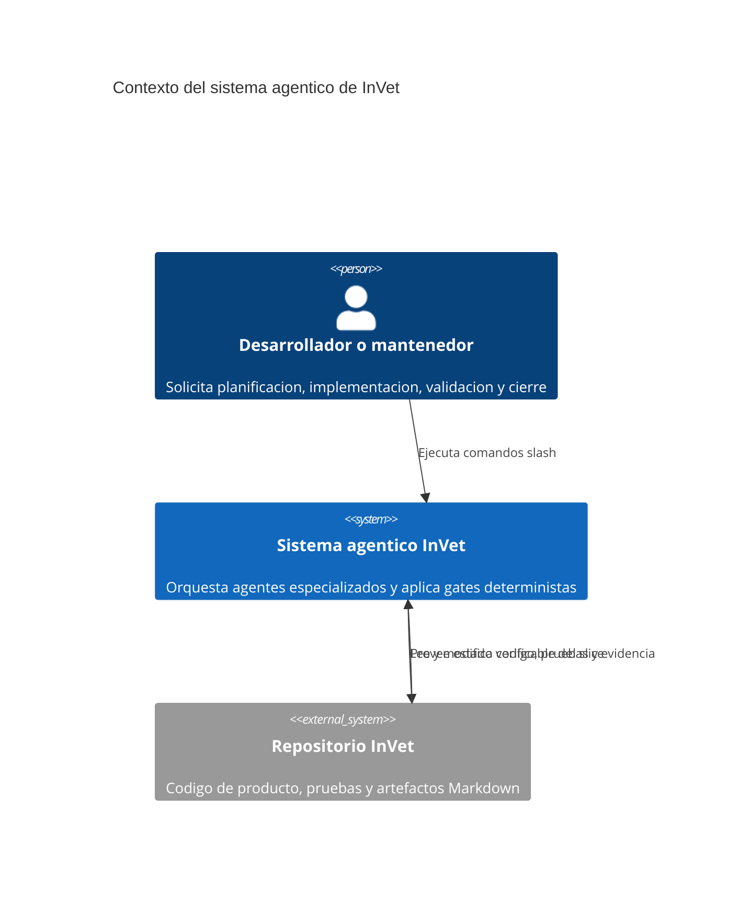
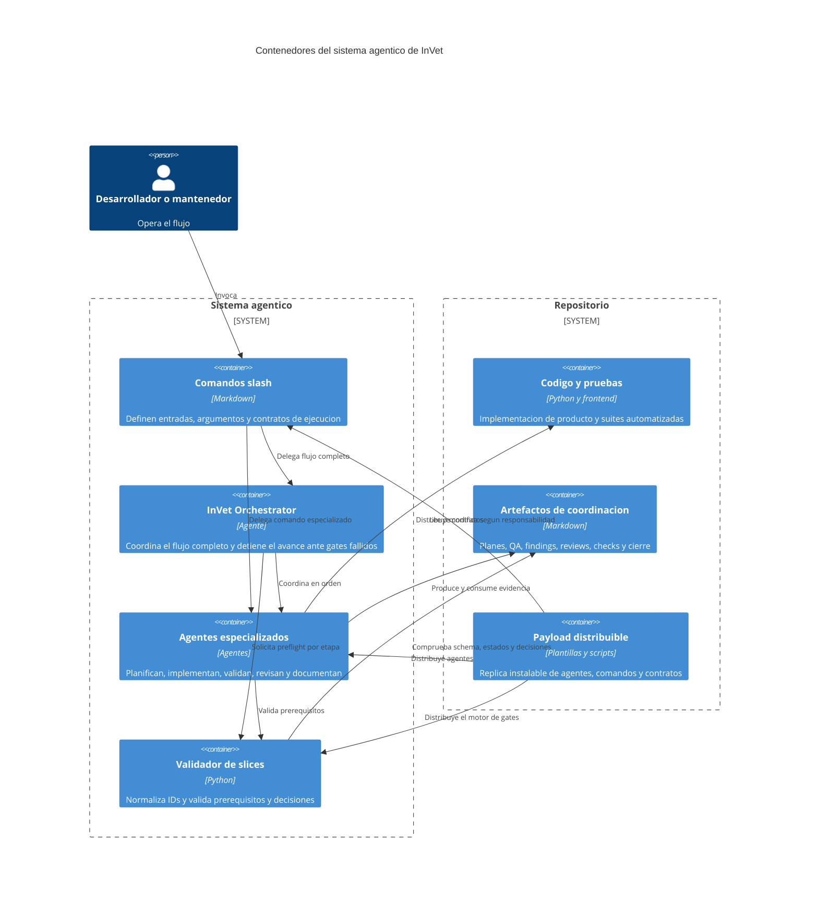
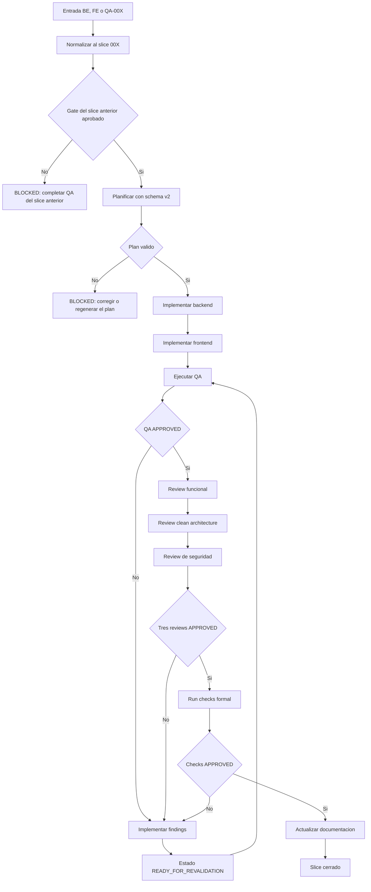
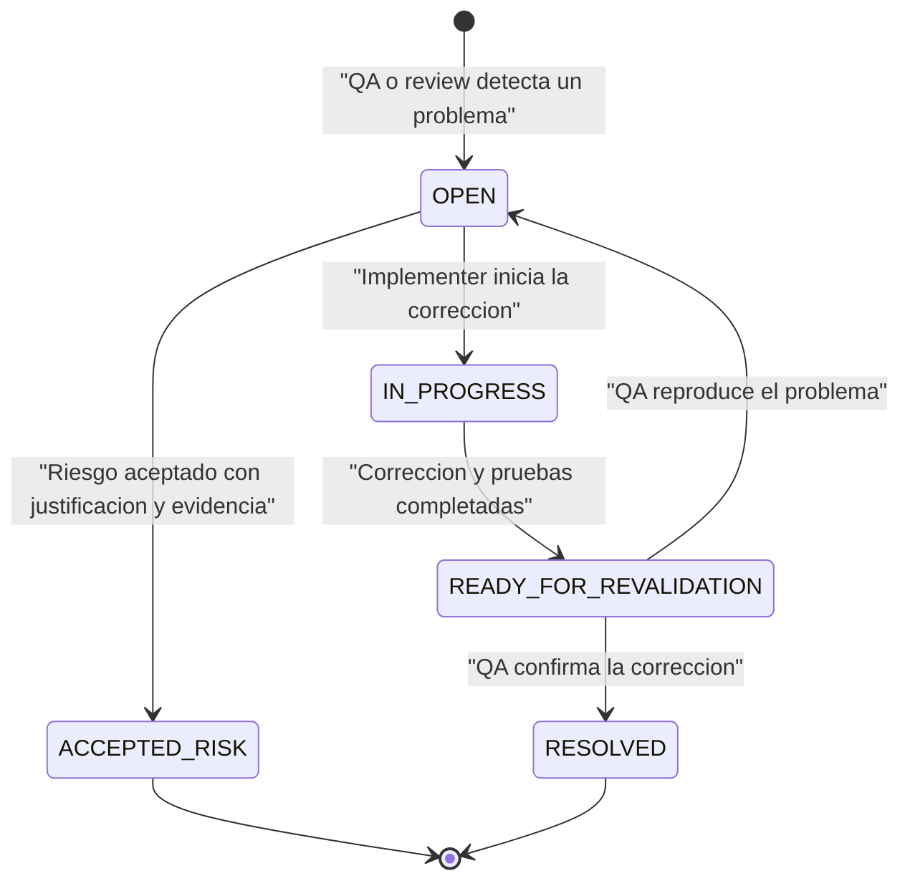

# Arquitectura agentica y gate flow de InVet

## Estado del documento

| Campo | Valor |
|---|---|
| Estado | Vigente |
| Contrato de plan | Schema v2 |
| Entrada orquestada | `/execute-slice BE-00X`, `/execute-slice FE-00X` o `/execute-slice QA-00X` |
| Motor de gates | `backend/scripts/validate_slice_plan.py` |
| Plan canonico | `docs/opencode/plans/BE-00X-plan.md` |
| Evidencia de cierre | QA, tres revisiones, checks y documentacion |

Este documento describe la arquitectura operativa actual de los agentes de InVet. Su objetivo es dejar claro como se coordinan, que archivos Markdown intercambian, quien puede modificar codigo y que condiciones bloquean el avance de un slice.

Las fuentes normativas complementarias son:

- `.opencode/agents/invet-orchestrator.md`
- `.opencode/commands/execute-slice.md`
- `backend/scripts/validate_slice_plan.py`
- `docs/opencode/04_agent_contracts.md`
- `docs/opencode/05_done_gates_by_command.md`

En caso de discrepancia, prevalecen el validador determinista y el contrato del comando que se esta ejecutando.

## Principios del sistema

1. Un slice funcional se identifica por un indice compartido: `BE-00X`, `FE-00X` y `QA-00X` pertenecen al mismo slice `00X`.
2. Existe un unico plan canonico por slice: `docs/opencode/plans/BE-00X-plan.md`.
3. `/plan-task` acepta identificadores BE, FE o QA y siempre normaliza al plan canonico BE del mismo indice.
4. Los agentes se coordinan mediante artefactos Markdown versionables; no dependen de memoria conversacional para decidir si un gate fue aprobado.
5. Los comandos especializados pueden ejecutarse directamente, pero su preflight aplica los mismos gates que el flujo orquestado.
6. La existencia de un archivo no equivale a aprobacion. Las decisiones y estados declarados dentro de los artefactos son obligatorios.
7. QA valida y bloquea, pero no corrige codigo de producto ni implementa las pruebas unitarias que corresponden a BE o FE.
8. Un slice solo se considera cerrado cuando QA, las tres revisiones y los checks estan aprobados, y la documentacion final fue actualizada.

## Entradas operativas

### Ejecucion completa

```text
/execute-slice FE-001
```

El identificador puede ser BE, FE o QA. El orquestador normaliza el indice y conduce el flujo completo sin cambiar de slice.

### Ejecucion especializada

```text
/plan-task FE-001
/implement-backend-task BE-001
/implement-frontend-task FE-001
/qa-task QA-001
/review-slice FE-001
/clean-architecture-review FE-001
/security-review FE-001
/implement-findings FE-001
/run-checks FE-001
/update-docs FE-001
```

Cada comando especializado ejecuta un preflight para comprobar que sus prerequisitos ya existen y estan aprobados. Esto evita que una invocacion directa omita los gates del orquestador.

`/run-checks` sin identificador conserva un uso diagnostico general, pero no genera evidencia formal ni cierra un slice. Para el gate de cierre debe utilizarse `/run-checks BE-00X`, `/run-checks FE-00X` o `/run-checks QA-00X`.

## C4 nivel 1: contexto



El usuario puede entrar por `/execute-slice` o por un comando especializado. En ambos casos, el estado persistido en el repositorio determina si el flujo puede continuar.

## C4 nivel 2: contenedores



## C4 nivel 3: flujo y gates



El orden canonico administrado por el orquestador es:

1. `/plan-task BE|FE|QA-00X`
2. `/implement-backend-task BE-00X`
3. `/implement-frontend-task FE-00X`
4. `/qa-task QA-00X`
5. `/review-slice BE-00X`
6. `/clean-architecture-review BE-00X`
7. `/security-review BE-00X`
8. `/implement-findings BE-00X`, solo cuando existen hallazgos bloqueantes
9. Repetir QA y las revisiones afectadas despues de corregir
10. `/run-checks BE-00X`
11. `/update-docs BE-00X`

Los prefijos mostrados en este orden son convencionales. El validador normaliza BE, FE y QA al mismo indice de slice.

## Responsabilidades por agente

| Agente | Comando principal | Responsabilidad | Puede modificar codigo | Evidencia o gate |
|---|---|---|---|---|
| InVet Orchestrator | `/execute-slice` | Normalizar el ID, coordinar agentes y detenerse ante gates fallidos | Solo por delegacion | Flujo completo del slice |
| Planner | `/plan-task` | Crear el plan canonico schema v2 con tareas BE, FE y QA trazables | No | `BE-00X-plan.md` valido |
| Backend Implementer | `/implement-backend-task` | Implementar backend y sus pruebas unitarias | Si, backend y pruebas relacionadas | Tareas BE y validaciones satisfechas |
| Frontend Implementer | `/implement-frontend-task` | Implementar UI, integracion y pruebas unitarias de frontend | Si, frontend y pruebas relacionadas | Tareas FE y validaciones satisfechas |
| QA Engineer | `/qa-task` | Ejecutar QA, ampliar pruebas de nivel QA y emitir decision | Solo pruebas y soporte QA, no producto | `QA-00X-results.md` con `APPROVED`, `REJECTED` o `BLOCKED`, y findings |
| Slice Reviewer | `/review-slice` | Revisar comportamiento, regresiones, trazabilidad y cobertura | No, excepto su reporte Markdown | `BE-00X-review.md` con decision |
| Clean Architecture Reviewer | `/clean-architecture-review` | Revisar limites, dependencias y mantenibilidad | No, excepto su reporte Markdown | `BE-00X-clean-architecture-review.md` con decision |
| Security Reviewer | `/security-review` | Revisar autenticacion, autorizacion, datos y riesgos | No, excepto su reporte Markdown | `BE-00X-security-review.md` con decision |
| Findings Implementer | `/implement-findings` | Corregir hallazgos en codigo y pruebas del propietario correcto | Si | Correcciones en `READY_FOR_REVALIDATION` |
| Check Runner | `/run-checks` | Ejecutar la suite integral y registrar resultados reproducibles | No deberia corregir producto | `BE-00X-checks.md` con decision |
| Documentation Agent | `/update-docs` | Consolidar documentacion y cierre despues de todos los gates | Solo documentacion | Documentacion final actualizada |

## Contrato del plan schema v2

El plan canonico debe incluir este frontmatter:

```yaml
---
schema_version: 2
slice: "00X"
canonical_plan: BE-00X
status: PLANNED
---
```

Debe cubrir explicitamente la planificacion frontend mediante estas secciones:

- Rutas y acceso
- Flujos y estados UX
- Contratos API por accion
- Formularios y validacion
- Arquitectura de componentes
- Responsive y accesibilidad
- Estrategia de pruebas frontend

Cada tarea usa el formato `- [ ] BE|FE|QA-00X-TNN - Titulo` e incluye:

| Campo | Proposito |
|---|---|
| `Capa` | Identifica backend, frontend o QA |
| `Objetivo` | Declara el resultado esperado |
| `Depende de` | Expresa dependencias explicitas |
| `Entregables` | Define archivos o capacidades a producir |
| `Criterios de aceptacion` | Establece condiciones observables |
| `Validacion` | Indica como comprobar el resultado |
| `Evidencia` | Define la prueba persistente del cumplimiento |
| `Paralelismo[P]` | Declara si la tarea puede ejecutarse en paralelo |

Un plan legacy o schema v1 es rechazado intencionalmente. Debe regenerarse con `/plan-task BE-00X`, `/plan-task FE-00X` o `/plan-task QA-00X`; los tres comandos apuntan al mismo plan canonico.

## Motor determinista de gates

`backend/scripts/validate_slice_plan.py` evita que los agentes interpreten de forma distinta el estado del slice. Acepta un ID BE, FE o QA y una etapa.

| Etapa | Validacion principal |
|---|---|
| `previous` | El QA del slice inmediatamente anterior no mantiene un bloqueo activo |
| `plan` | Existe el plan canonico, usa schema v2 y contiene estructura y tareas validas |
| `backend` | El gate anterior y el plan permiten iniciar implementacion backend |
| `frontend` | El plan y prerequisitos permiten iniciar implementacion frontend |
| `qa` | El plan e implementaciones requeridas permiten evaluar el slice |
| `findings` | Existen hallazgos accionables que pueden ser corregidos |
| `review` | QA esta aprobado y el slice puede entrar a revision |
| `checks` | QA y las tres revisiones declaran `Decision: APPROVED` |
| `docs` | QA, revisiones y reporte formal de checks estan aprobados |

Los comandos deben tratar una salida no exitosa del validador como `BLOCKED`. No esta permitido continuar basandose solo en que los archivos existen.

## Propiedad de las pruebas

La separacion de responsabilidades evita que QA oculte defectos de implementacion al corregir el producto que debe evaluar.

| Tipo de prueba | Propietario primario | Puede crearla QA | Ausencia bloquea |
|---|---|---|---|
| Unitarias de backend | Backend Implementer | No | Si |
| Unitarias de frontend | Frontend Implementer | No | Si |
| Aceptacion | QA Engineer | Si | Si, cuando corresponde al criterio |
| Integracion | QA Engineer o implementador segun el plan | Si | Si, cuando corresponde al riesgo |
| Contrato API | QA Engineer | Si | Si, cuando protege una integracion critica |
| Seguridad | QA Engineer y Security Reviewer | QA puede crear pruebas; reviewer emite hallazgos | Si para riesgos no mitigados |
| Regresion | QA Engineer | Si | Si para regresiones relevantes |
| Fixtures, mocks y factories de QA | QA Engineer | Si | Segun necesidad de la suite |

Si QA detecta codigo de producto sin pruebas unitarias suficientes, debe:

1. Marcar el criterio correspondiente como `FAIL`.
2. Crear un finding `OPEN` con evidencia concreta.
3. Emitir `Decision: REJECTED`.
4. Bloquear el avance hasta que Backend Implementer, Frontend Implementer o Findings Implementer agregue las pruebas.
5. Volver a ejecutar `/qa-task QA-00X` para resolver el gate.

QA no debe modificar codigo de producto para hacer pasar su propia evaluacion.

## Ciclo de vida de findings



Reglas del ciclo:

- `/implement-findings` nunca marca un finding como `RESOLVED`; su estado final es `READY_FOR_REVALIDATION`.
- Solo QA puede declarar `RESOLVED` despues de ejecutar evidencia reproducible.
- `OPEN`, `IN_PROGRESS` y `READY_FOR_REVALIDATION` son estados bloqueantes.
- `ACCEPTED_RISK` es no bloqueante unicamente cuando incluye responsable, justificacion y evidencia explicita de aceptacion.
- Despues de una correccion se repiten QA y las revisiones afectadas antes de ejecutar checks.

## Artefactos de coordinacion

| Artefacto | Productor | Consumidores | Funcion |
|---|---|---|---|
| `docs/opencode/plans/BE-00X-plan.md` | Planner | Todos | Plan canonico y trazabilidad de tareas |
| `docs/opencode/qa/QA-00X-results.md` | QA Engineer | Orchestrator, reviewers, checks | Resultados por criterio y decision QA |
| `docs/opencode/qa/QA-00X-findings.md` | QA Engineer y reviewers | Findings Implementer, QA | Hallazgos y estados de revalidacion |
| `docs/opencode/reviews/BE-00X-review.md` | Slice Reviewer | Orchestrator, checks | Decision funcional y de regresion |
| `docs/opencode/reviews/BE-00X-clean-architecture-review.md` | Clean Architecture Reviewer | Orchestrator, checks | Decision arquitectonica |
| `docs/opencode/reviews/BE-00X-security-review.md` | Security Reviewer | Orchestrator, checks | Decision de seguridad |
| `docs/opencode/reviews/BE-00X-corrections.md` | Findings Implementer | QA y reviewers | Evidencia de cambios preparados para revalidacion |
| `docs/opencode/checks/BE-00X-checks.md` | Check Runner | Documentation Agent | Resultado integral reproducible y decision de checks |
| Documentacion y changelog del proyecto | Documentation Agent | Equipo | Cierre funcional y operativo |

Cada reviewer genera siempre su reporte, incluso cuando no encuentra problemas. La ausencia del reporte o de `Decision: APPROVED` impide pasar al gate de checks.

## Matriz de gates

| Transicion | Requisito de entrada | Resultado que permite avanzar | Resultado bloqueante |
|---|---|---|---|
| Inicio -> Plan | Gate del slice anterior valido | Plan schema v2 | Slice anterior bloqueado |
| Plan -> Backend | Plan valido | Implementacion BE y unit tests | Plan incompleto o legacy |
| Plan/Backend -> Frontend | Plan frontend explicito y contratos disponibles | Implementacion FE y unit tests | Gap de UX, API o dependencias |
| Implementacion -> QA | Entregables y validaciones del plan disponibles | `Decision: APPROVED` | Criterios FAIL, infraestructura no reproducible o unit tests ausentes |
| QA -> Reviews | QA aprobado | Tres reportes `APPROVED` | Cualquier reporte ausente o `REJECTED` |
| Findings -> Revalidacion | Correcciones en `READY_FOR_REVALIDATION` | QA y reviews afectados aprobados nuevamente | Findings todavia reproducibles |
| Reviews -> Checks | QA y tres reviews aprobados | Checks `APPROVED` | Fallos de suite, lint, build o infraestructura |
| Checks -> Docs | Reporte formal de checks aprobado | Documentacion actualizada | Checks ausentes o rechazados |
| Docs -> Cierre | Todos los artefactos trazables | Slice cerrado | Evidencia incompleta |

## Gate del slice anterior

Antes de iniciar un nuevo indice, el validador comprueba el QA del slice inmediatamente anterior. Esto convierte QA en un gate de entrega y evita acumular trabajo nuevo sobre una base conocida como defectuosa.

El bloqueo se basa en el estado y la decision del artefacto, no solo en su existencia. Un finding no bloquea si esta `RESOLVED` o si fue formalmente marcado `ACCEPTED_RISK`; los demas estados impiden continuar.

## Ejecucion recomendada

Para un flujo completo:

```text
/execute-slice FE-001
```

Para operar paso a paso:

```text
/plan-task FE-001
/implement-backend-task BE-001
/implement-frontend-task FE-001
/qa-task QA-001
/review-slice FE-001
/clean-architecture-review FE-001
/security-review FE-001
```

Si hay findings:

```text
/implement-findings FE-001
/qa-task QA-001
/review-slice FE-001
/clean-architecture-review FE-001
/security-review FE-001
```

Cuando todos los gates estan aprobados:

```text
/run-checks FE-001
/update-docs FE-001
```

## Definicion de slice cerrado

Un slice esta cerrado solo si se cumplen todas estas condiciones:

- El plan canonico usa schema v2 y representa tareas BE, FE y QA.
- Backend y frontend implementaron sus entregables y pruebas unitarias.
- QA declaro `Decision: APPROVED` con evidencia reproducible.
- No quedan findings bloqueantes.
- Review funcional declaro `Decision: APPROVED`.
- Review de clean architecture declaro `Decision: APPROVED`.
- Review de seguridad declaro `Decision: APPROVED`.
- El reporte formal de checks declaro `Decision: APPROVED`.
- La documentacion final fue actualizada.

La finalizacion de una tarea de codigo, por si sola, no cierra el slice.

## Distribucion y mantenimiento

El directorio de payload es el espejo distribuible del sistema agentico. Los cambios a agentes, comandos, plantillas, validador o contratos operativos deben mantenerse sincronizados entre la configuracion activa y su payload instalable.

Las pruebas de contrato deben verificar como minimo:

- Registro y despliegue de `/execute-slice`.
- Sincronizacion de agentes y comandos.
- Despliegue de `backend/scripts/validate_slice_plan.py`.
- Compatibilidad de plantillas con schema v2.
- Presencia de los campos y decisiones requeridos en artefactos.
- Rechazo de planes legacy y de gates incompletos.

Cuando cambie el flujo, primero deben actualizarse los contratos ejecutables y el validador; despues, este documento y las plantillas asociadas. Asi la documentacion describe comportamiento comprobable y no una intencion futura.
