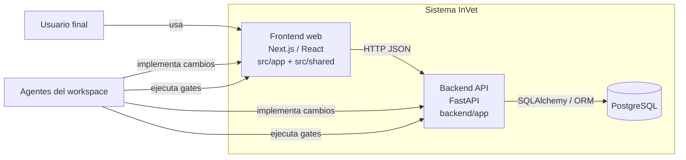
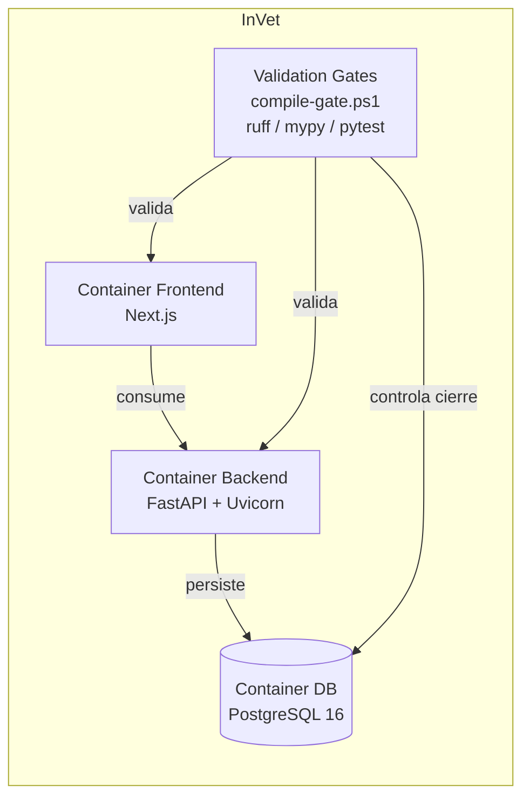
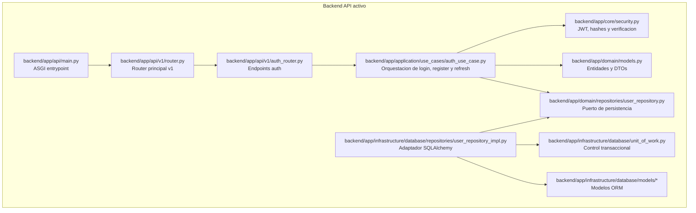
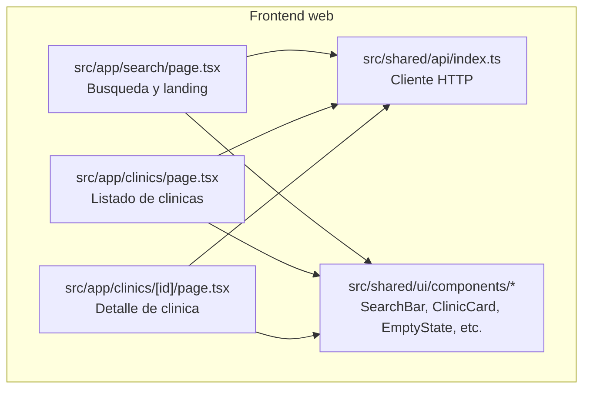
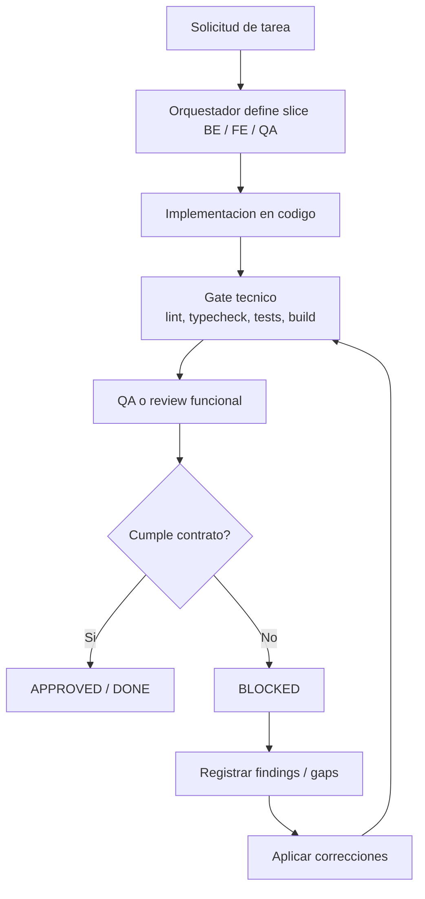

# Reporte de funcionamiento agentico de InVet

## Alcance

Este documento describe el funcionamiento agentico implementado en el workspace de InVet, con foco en:

- La forma en que se organizan los roles de trabajo.
- Las responsabilidades de cada agente.
- Los comandos y gates que ya existen en el proyecto.
- Un ejemplo practico para tareas de BE, FE y QA.
- La arquitectura del proyecto usando diagramas C4.
- El flujo de validacion y bloqueo.

Para una guia paso a paso orientada a cualquier desarrollador, ver `docs/opencode/guia-uso-agentes-desarrolladores.md`.

## Base de observacion

Este reporte se construyo a partir de los archivos visibles en el repositorio, en especial:

- `scripts/compile-gate.ps1`
- `docker-compose.yml`
- `backend/pyproject.toml`
- `backend/requirements.txt`
- `backend/app/api/main.py`
- `backend/app/api/v1/router.py`
- `backend/app/api/v1/auth_router.py`
- `backend/app/application/use_cases/auth_use_case.py`
- `backend/app/core/security.py`
- `backend/app/infrastructure/database/*`
- `src/app/*`
- `src/shared/*`
- `docs/opencode/reviews/*`
- `docs/opencode/qa/QA-003-findings.md`
- `backend/app/tests/test_secure_persistence_contracts.py`
- `backend/app/tests/test_docker_compose_closure_hooks.py`

Nota: algunas rutas de contrato que las pruebas mencionan para `.opencode` y `payload/` no estan materializadas como texto en este checkout. Aun asi, las pruebas dejan claro que esos contratos forman parte del flujo esperado.

## Resumen Ejecutivo

El sistema agentico de InVet funciona como un ciclo de trabajo con tres capas:

1. **Orquestacion**: decide el tipo de tarea, la divide en slices y define el gate que debe pasar.
2. **Implementacion**: BE y FE aplican cambios en su capa correspondiente.
3. **Validacion**: QA y los gates automatizados confirman que el cambio cumple contrato, seguridad y regresion minima.

La regla central es simple: **si el gate no pasa, la tarea no se cierra**.
Ademas, los stages `review`, `checks` y `docs` funcionan como gates de cierre estricto: si queda una tarea aplicable abierta o una cancelacion sin evidencia verificable, el slice sigue abierto.
Cuando el cierre depende de Docker, `db`, `backend` y `frontend` deben quedar actualizados o recreados y saludables; no basta con un arranque parcial.

## Roles y responsabilidades

| Rol | Responsabilidad principal | Entradas tipicas | Salidas esperadas |
|---|---|---|---|
| Orquestador | Descompone la tarea, asigna slice BE/FE/QA y define el gate requerido | Solicitud del usuario, estado del repo, contratos vigentes | Plan de trabajo, secuencia de ejecucion, decision de aprobado o bloqueado |
| Agente BE | Implementa logica de negocio, API, persistencia y seguridad del backend | Contrato de endpoints, modelo de dominio, reglas de negocio | Routers, use cases, repositorios, modelos, tests de backend |
| Agente FE | Implementa la experiencia de usuario, consumo de API y estados UI | Contrato visual, datos expuestos por la API, componentes compartidos | Paginas, componentes reutilizables, cliente API, tests UI |
| Agente QA | Verifica happy path, negative path, permisos, regresion y evidencia | Build result, endpoints, flujos y criterios de aceptacion | Findings, aprobacion o bloqueo, evidencia de prueba |
| Gate automatizado | Ejecuta validaciones repetibles y detiene el flujo si algo falla | Codigo nuevo, cambios de contrato, pruebas y lint | Pass/Fail objetivo, base para aprobar o bloquear |

## Listado de agentes

El sistema se apoya en estos agentes operativos:

1. **Agente Orquestador**
2. **Agente BE**
3. **Agente FE**
4. **Agente QA**
5. **Agente de hallazgos o correcciones**

Ademas, el flujo usa comandos de cierre y validacion que no son agentes por si mismos, pero forman parte de la misma cadena:

- `execute-slice`
- `implement-backend-task`
- `implement-frontend-task`
- `qa-task`
- `implement-findings`
- `run-checks`

### Agente Orquestador

**Como usarlo**

- Se usa al inicio de una tarea nueva o cuando hay que dividir una solicitud en partes.
- Es la primera pieza que decide si la tarea requiere BE, FE, QA o una combinacion.

**Como funciona**

- Lee el alcance.
- Decide el slice.
- Ordena la secuencia de trabajo.
- Define el gate que protegera el cierre.
- No suele hacer cambios funcionales directos; su valor esta en coordinar el flujo.

**Comandos que ejecuta o dispara**

- `execute-slice`
- `validate_slice_plan.py` cuando el slice requiere validacion de stage, por ejemplo `secure-persistence`

**Resultados o entregables**

- Definicion del slice.
- Orden de ejecucion.
- Criterio de terminado.
- Decision preliminar de aprobado o bloqueado.

### Agente BE

**Como usarlo**

- Se usa cuando el cambio afecta API, dominio, persistencia, autenticacion o reglas del backend.
- Tambien se usa cuando el contrato tecnico necesita nuevas validaciones o nuevos estados de error.

**Como funciona**

- Ajusta modelo de dominio, use cases, repositorios y routers.
- Mantiene la seguridad y la consistencia de contratos.
- Trabaja sobre la capa backend antes de que FE o QA den el cierre final.

**Comandos que ejecuta o dispara**

- `implement-backend-task`
- `python -m ruff check app`
- `python -m mypy app`
- `python -m pytest app/tests -q`
- `python backend/scripts/validate_slice_plan.py BE-002 --stage secure-persistence` cuando aplica el gate de persistencia segura

**Resultados o entregables**

- Endpoints o casos de uso actualizados.
- Repositorios y modelos ajustados.
- Pruebas de backend en verde.
- Evidencia de que el contrato tecnico del backend quedo estable.

### Agente FE

**Como usarlo**

- Se usa cuando la tarea cambia pantallas, estados UI, navegacion, busqueda, detalles o componentes compartidos.
- Tambien se usa cuando el frontend debe adaptarse a un contrato nuevo del backend.

**Como funciona**

- Consume la API real.
- Construye la experiencia visual.
- Maneja loading, error y empty state.
- Mantiene consistencia entre pantallas y componentes reutilizables.

**Comandos que ejecuta o dispara**

- `implement-frontend-task`
- `npm run gate`
- `npm run build`
- `docker compose up -d --build --force-recreate db backend frontend` cuando se valida la integracion completa

**Resultados o entregables**

- Paginas y componentes funcionales.
- Cliente API alineado al contrato backend.
- Estados visuales completos.
- Build del frontend estable.

### Agente QA

**Como usarlo**

- Se usa al final del cambio, una vez que BE y FE ya dejaron el comportamiento listo.
- Tambien se usa si un cambio previo quedo bloqueado y hace falta confirmar el arreglo.

**Como funciona**

- Revisa el flujo de punta a punta.
- Verifica escenarios positivos y negativos.
- Comprueba permisos y regresion.
- Traduce el resultado en findings concretos.

**Comandos que ejecuta o dispara**

- `qa-task`
- `run-checks`
- `pytest app/tests/api/test_auth_api.py`
- `run-checks.ps1`

**Resultados o entregables**

- Findings documentados.
- Estado `APPROVED` o `BLOCKED`.
- Evidencia de validacion.
- Confirmacion de que el slice cumple o no cumple el contrato esperado.

### Agente de hallazgos o correcciones

**Como usarlo**

- Se usa cuando QA detecta algo que no debe quedar pendiente.
- Su funcion es convertir hallazgos en correcciones concretas, no discutir el problema de forma abstracta.

**Como funciona**

- Lee los findings.
- Ajusta el codigo o el contrato afectado.
- Repite el tramo de validacion que fallo.
- Vuelve a entregar evidencia.

**Comandos que ejecuta o dispara**

- `implement-findings`
- Los mismos comandos de cierre que fallaron en la ronda anterior

**Resultados o entregables**

- Correccion aplicada.
- Revalidacion completa.
- Hallazgo resuelto o reducido.
- Insumo listo para que QA vuelva a revisar.

## Modelo de funcionamiento agentico

El flujo implementado puede leerse asi:

1. El orquestador recibe una tarea o slice.
2. Identifica si el trabajo es de backend, frontend o validacion.
3. Asigna el conjunto minimo de archivos que deben tocarse.
4. Ordena la ejecucion de comandos de verificacion.
5. Si una validacion falla, el trabajo queda bloqueado.
6. Si todas las validaciones pasan, QA emite el dictamen final y el slice queda aprobado.

En la practica, el proyecto aplica este modelo con trazabilidad en:

- Reviews de BE-002 y BE-003.
- Findings de QA-003.
- Tests de contratos para gates, hooks y validaciones.
- Un comando de compilacion que encadena verificaciones de frontend y backend.

## Como usar los agentes para completar una tarea completa

Cuando una tarea afecta mas de una capa, la forma correcta de trabajarla es en cadena, no como un cambio aislado. El orden recomendado es:

1. **Definir el alcance**.
2. **Separar la tarea por slice**.
3. **Implementar BE si la logica o el contrato cambian**.
4. **Implementar FE si cambia la experiencia o el consumo de API**.
5. **Ejecutar QA para confirmar comportamiento y evidencia**.
6. **Pasar los gates tecnicos y funcionales**.
7. **Cerrar solo cuando todo quede aprobado**.

### Secuencia recomendada

#### 1. Arranque con el orquestador

El orquestador toma la solicitud y define:

- Que parte es backend.
- Que parte es frontend.
- Que parte es validacion.
- Que gate debe proteger el cierre.

Ejemplo:

- Si la tarea es "agregar busqueda de clinicas", el orquestador separa:
  - BE: contrato del endpoint y paginacion.
  - FE: buscador, filtros y resultados.
  - QA: happy path, empty state y regresion.

#### 2. Trabajo del agente BE

El agente BE debe:

- Definir o ajustar modelos, casos de uso y repositorios.
- Exponer o modificar endpoints.
- Asegurar manejo correcto de errores.
- Mantener seguridad y validaciones.
- Dejar pruebas del backend listas para el gate.

Regla practica:

- Si el cambio altera la forma en que se obtienen o persisten datos, BE va primero.
- Si el backend no queda estable, FE no deberia cerrarse aun.

#### 3. Trabajo del agente FE

El agente FE debe:

- Consumir el contrato real del backend.
- Representar estados de carga, error y vacio.
- Conservar consistencia visual.
- Evitar suponer campos que la API no expone.

Regla practica:

- Si el contrato de API cambia, FE se ajusta al contrato nuevo, no al viejo.
- Si hay incertidumbre en el contrato, se vuelve a BE antes de cerrar FE.

#### 4. Trabajo del agente QA

El agente QA debe:

- Confirmar que el flujo completo funciona.
- Ejecutar escenarios positivos y negativos.
- Revisar permisos, si aplica.
- Confirmar que no haya regresion.
- Registrar evidencia clara y decision final.

Regla practica:

- QA no solo confirma que "compila".
- QA confirma que la experiencia completa coincide con el contrato y con lo esperado por negocio.

### Ejemplo de flujo completo

Ejemplo: "Agregar una busqueda publica de clinicas con detalle".

1. **Orquestador** define el slice y el criterio de terminado.
2. **BE** expone o ajusta `/api/v1/clinics` y `/api/v1/clinics/{id}`.
3. **FE** implementa buscador, listado, detalle y estados de carga/error/vacio.
4. **QA** valida:
   - Que la busqueda devuelve resultados.
   - Que un termino sin coincidencias muestra empty state.
   - Que el detalle de una clinica abre correctamente.
   - Que no se rompio la navegacion ni el listado general.
5. **Gate tecnico** corre lint, typecheck, tests y build.
6. **Cierre** solo ocurre cuando QA y gates estan en verde.

### Criterio de bloqueo durante una tarea completa

Una tarea completa se considera bloqueada si:

- BE no puede sostener el contrato requerido.
- FE depende de datos que la API no entrega.
- QA encuentra un comportamiento incorrecto.
- El gate tecnico falla.

En ese caso, el flujo correcto es volver al agente que tiene la causa raiz y no forzar el cierre.

## Comandos existentes

### Gates y validaciones

| Comando | Donde se observa | Proposito |
|---|---|---|
| `powershell scripts/compile-gate.ps1` | `scripts/compile-gate.ps1` | Gate maestro que ejecuta frontend, lint, typecheck y tests del backend |
| `npm run gate` | Referenciado por `scripts/compile-gate.ps1` | Gate del frontend invocado desde el gate maestro |
| `python -m ruff check app` | `scripts/compile-gate.ps1`, `backend/pyproject.toml`, `backend/requirements.txt` | Lint del backend |
| `python -m mypy app` | `scripts/compile-gate.ps1`, `backend/pyproject.toml` | Typecheck del backend |
| `python -m pytest app/tests -q` | `scripts/compile-gate.ps1`, `backend/pyproject.toml` | Tests unitarios y de integracion del backend |
| `python backend/scripts/validate_slice_plan.py BE-002 --stage secure-persistence` | `docs/opencode/reviews/BE-002-security-review.md` | Gate de persistencia segura usado como contrato de validacion |
| `docker compose up -d --build --force-recreate db backend frontend` | Referenciado por pruebas de cierre | Reconstruye y levanta la pila completa |

### Arranque y despliegue local

| Comando | Donde se observa | Proposito |
|---|---|---|
| `uvicorn app.api.main:app --host 0.0.0.0 --port 8000` | `backend/Dockerfile` y `docker-compose.yml` | Levanta la API FastAPI del backend |
| `npm run build` | `frontend/Dockerfile` | Construye el frontend para produccion |
| `python -m alembic revision --autogenerate -m "..."` | `backend/Readme.md` | Genera una migracion desde modelos existentes |
| `python -m alembic upgrade head` | `backend/Readme.md` | Aplica migraciones |

### Pruebas de soporte

| Comando | Donde se observa | Proposito |
|---|---|---|
| `pytest app/tests/test_database.py` | `backend/Readme.md` | Verifica modelos y persistencia basica |
| `python -m pytest app/tests/api/test_auth_api.py` | `docs/opencode/reviews/BE-002-review.md` | Valida el flujo de autenticacion |
| `run-checks.ps1` | `docs/opencode/qa/QA-003-findings.md` | Corrida completa de checks de regresion |

## Ejemplo de implementacion por tipo de tarea

### 1. Tarea BE

Ejemplo: agregar o ajustar un flujo de autenticacion o de persistencia.

Secuencia tipica:

1. Definir o actualizar el contrato del endpoint.
2. Ajustar dominio, casos de uso y repositorios.
3. Conectar el router FastAPI.
4. Validar seguridad y manejo de errores.
5. Correr lint, typecheck y tests.
6. Registrar review o findings segun resultado.

Ejemplo concreto tomado del backend actual:

- `backend/app/api/v1/auth_router.py` expone `POST /register`, `POST /login`, `POST /refresh` y `GET /me`.
- `backend/app/application/use_cases/auth_use_case.py` orquesta registro, login, refresh y perfil.
- `backend/app/core/security.py` maneja hash de contrasena, JWT y verificacion de tokens.
- `backend/app/infrastructure/database/unit_of_work.py` encapsula el ciclo de transaccion.

Comandos de cierre para BE:

```powershell
python -m ruff check app
python -m mypy app
python -m pytest app/tests -q
```

### 2. Tarea FE

Ejemplo: construir o ajustar una pantalla publica, el cliente API y los estados de UI.

Secuencia tipica:

1. Definir ruta y experiencia de usuario.
2. Crear o ajustar componentes reutilizables.
3. Conectar el cliente API.
4. Manejar loading, error y empty state.
5. Verificar responsive y consistencia visual.
6. Validar build del frontend y gate asociado.

Ejemplo concreto tomado del frontend actual:

- `src/app/search/page.tsx` hace el fetch de clinicas con busqueda y filtros.
- `src/app/clinics/page.tsx` muestra el listado general.
- `src/app/clinics/[id]/page.tsx` resuelve el detalle de una clinica.
- `src/shared/api/index.ts` centraliza el consumo de `/api/v1/clinics`.
- `src/shared/ui/components/*` encapsula piezas reutilizables como `SearchBar`, `ClinicCard`, `EmptyState` y `LoadingSkeleton`.

Comandos de cierre para FE:

```powershell
docker compose up -d --build --force-recreate db backend frontend
```

Ademas, el frontend se construye con:

```powershell
npm run build
```

### 3. Tarea QA

Ejemplo: validar que el cambio no rompe el contrato y que cumple los criterios del slice.

Secuencia tipica:

1. Verificar happy path.
2. Probar paths negativos.
3. Revisar permisos e IDOR/BOLA cuando aplique.
4. Ejecutar regresion minima.
5. Documentar findings con estado `APPROVED` o `BLOCKED`.

Ejemplo concreto tomado del repo:

- `docs/opencode/qa/QA-003-findings.md` documenta resultados, evidencias y estado `APPROVED`.
- `docs/opencode/reviews/BE-002-security-review.md` valida el gate de persistencia segura con `validate_slice_plan.py`.

Salida esperada de QA:

- Si todo pasa, el slice queda `APPROVED`.
- Si hay hallazgos criticos o un contrato roto, el slice queda bloqueado hasta corregirlo.

## Arquitectura C4

### C4 - Contexto



### C4 - Contenedores



### C4 - Componentes del backend



### C4 - Componentes del frontend



## Diagrama de gates y bloqueo



## Como funciona el gate de validacion

El gate de validacion tiene un objetivo muy simple: asegurar que la tarea sea repetible, verificable y segura antes de declararla terminada.

### Gate tecnico

El gate tecnico se apoya en:

- `compile-gate.ps1` como orquestador local.
- `ruff` para lint.
- `mypy` para tipado.
- `pytest` para pruebas.
- `npm run gate` para el lado frontend.

### Gate funcional

El gate funcional revisa:

- Happy path.
- Negative path.
- Permisos.
- Regresion minima.
- Evidencia documentada.

### Gate de seguridad

En BE-002 y BE-003 el repo deja ver dos ideas importantes:

- Persistencia segura.
- Separacion de responsabilidades y control de acceso.

Cuando un gate de seguridad falla, la tarea no debe pasar a aprobado aunque el build compile.

## Como funciona el bloqueo

El bloqueo no es un castigo; es una proteccion del flujo.

Una tarea queda bloqueada cuando ocurre cualquiera de estas condiciones:

- Un test clave falla.
- El lint o el typecheck fallan.
- El contrato del slice no coincide con lo esperado.
- QA encuentra un problema critico o una regresion.
- Hay una brecha de seguridad o de permisos.

Cuando se bloquea:

1. Se registra el hallazgo.
2. Se deja claro que falta corregir.
3. No se emite cierre ni aprobacion.
4. El trabajo vuelve a la fase de implementacion.

El desbloqueo ocurre cuando la correccion vuelve a pasar los gates y QA confirma el resultado.

## Referencias de estado observadas

- `docs/opencode/reviews/BE-002-review.md` y `docs/opencode/reviews/BE-002-final-review.md` muestran estados `APPROVED`.
- `docs/opencode/reviews/BE-002-security-review.md` muestra el uso del gate de persistencia segura.
- `docs/opencode/qa/QA-003-findings.md` registra QA-003 como `APPROVED`.
- `backend/app/tests/test_docker_compose_closure_hooks.py` verifica que el hook de cierre y los contratos de gates estan sincronizados.

## Conclusiones

El proyecto ya tiene un flujo agentico utilizable y coherente:

- El orquestador define el slice.
- BE y FE implementan en su capa.
- QA confirma el resultado.
- Los gates impiden cerrar trabajo que no esta validado.

La arquitectura visible encaja con un modelo de trabajo por roles y contratos, donde la aprobacion final solo ocurre cuando codigo, pruebas y evidencia cuentan la misma historia.
